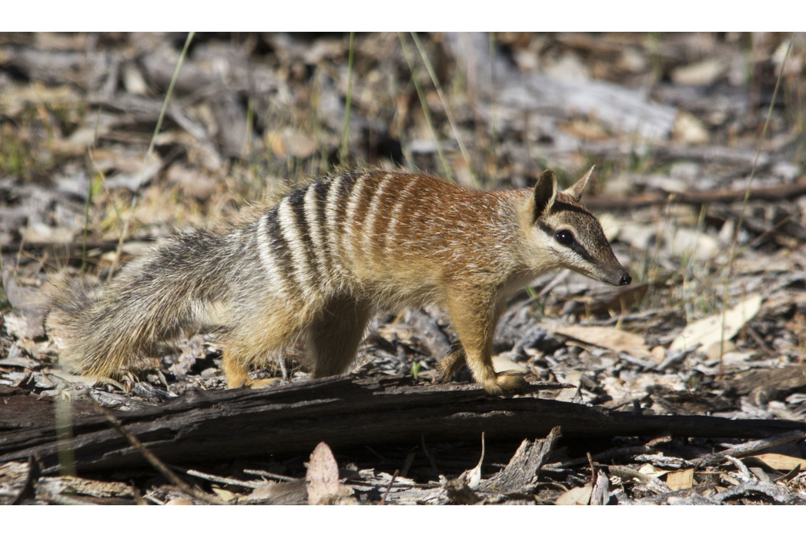

```{css, echo=FALSE}
h1, h2, h3 {
  text-align: center;
}
```

## **Numbat**
### *Myrmecobius fasciatus*
### Blamed on foxes

:::: {style="display: flex;"}

[](https://www.inaturalist.org/photos/62718512?size=original)

::: {}

:::

::: {}
  ```{r map, echo=FALSE, fig.cap="", out.width = '100%'}
  knitr::include_graphics("assets/figures/Map_Fox_Myrmecobius fasciatus.png")
  ```
:::

::::
<center>
IUCN status: **Endangered**

EPBC Predator Threat Rating: ****

IUCN claim: *"The introduction of the predatory Red Fox and feral cats has had a profound impact and continues to be a major threat today (Friend 2008)."*

</center>

### Studies in support

A poison-baiting campaign initiated in 1982 was followed by a population increase (Friend 1990) until 1992 (Friend & Thomas 1994). Friend (1990) argued that numbat range contraction was more rapid in the arid zone during the 1940s and 1950s when foxes established in the area though no formal analysis was provided.

### Studies not in support

The poison-baiting campaign that saw an initial population increase (1982-1992) was followed by a population crash (Friend & Page 2017). Foxes were not the main cause of mortality nor the main predator of reintroduced numbats (Friend & Thomas 1994). Numbats originally occurred across much of the southern half of Australia. Numbat distribution began to contract in the mid-1800s before foxes established (Friend 1990). Numbats were last confirmed in NSW and Adelaide before foxes arrived (Current submission).

### Is the threat claim evidence-based?

There are no studies evidencing a negative association between numbats and foxes. Poison-baiting is not a reliable proxy for fox abundance. In contradiction with the claim, the extirpation record pre-dates the fox arrival record.
<br>
<br>

![**Evidence linking *Myrmecobius fasciatus* to foxes.** **A.** Systematic review of evidence for an association between *Myrmecobius fasciatus* and foxes. Positive studies are in support of the hypothesis that foxes contribute to the decline of *Myrmecobius fasciatus*, negative studies are not in support. Predation studies include studies documenting hunting or scavenging; baiting studies are associations between poison baiting and threatened mammal abundance where information on predator abundance is not provided; population studies are associations between threatened mammal and predator abundance. **B.** Last records of extirpated populations relative to earliest local records of foxes. Error bars show record uncertainty range. Predator arrival records were digitized from Fairfax 2019. See methods section in [current submission] for details on evidence categories.](assets/figures/Main_Evidence_Fox_Myrmecobius fasciatus.png)

### References

Current submission (2023) Scant evidence that introduced predators cause extinctions.

EPBC. (2013) Threat Abatement Plan for Predation by the European Red Fox (2008). Five yearly review. Environment Protection and Biodiversity Conservation Act 1999, Department of the Environment, Water, Heritage and the Arts, Government of Australia (Appendix E: EPBC Act listed threatened species).

Fairfax, Dispersal of the introduced red fox (Vulpes vulpes) across Australia. Biol. Invasions 21, 1259-1268 (2019).

Friend, J.A. and Thomas, N.D., 1994. Reintroduction and the numbat recovery programme. Reintroduction Biology of Australian and New Zealand Fauna’.(Ed. M. Serena.) pp, pp.189-198.

Friend, J.A., 1990. The numbat Myrmecobius fasciatus (Myrmecobiidae): history of decline and potential for recovery. In Proceedings of the Ecological Society of Australia (Vol. 16, pp. 369-377).

Friend, J.A., Page, M.J., 2017. Numbat (Myrmecobius fasciatus) Recovery Plan. Wildlife Management Program No. 60 in Department of Parks and Wildlife, Western Australia

IUCN Red List. https://www.iucnredlist.org/ Accessed June 2023

