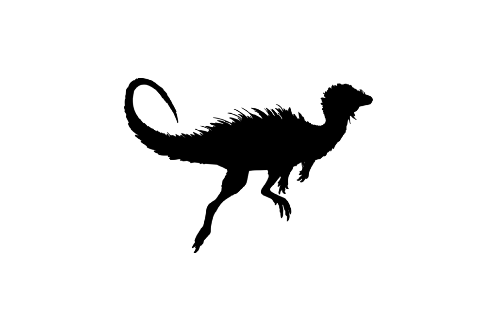

```{css, echo=FALSE}
h1, h2, h3 {
  text-align: center;
}
```

## **Numbat**
### *Myrmecobius fasciatus*
### Blamed on foxes

:::: {style="display: flex;"}

::: {}
  ```{r icon, echo=FALSE, fig.cap="", out.width = '100%'}
  
  ```
:::

::: {}

:::

::: {}
  ```{r map, echo=FALSE, fig.cap="", out.width = '100%'}
  
  ```
:::

::::
<center>
IUCN Status: **Near Threatened**

EPBC Threat Rating: **Very high/Extreme**

IUCN Claim: *'The introduction of the predatory Red Fox and feral cats has had a profound impact and continues to be a major threat today (Friend 2008).''*

</center>

### Studies in support

A poison baiting campaign initiated in 1982 was followed by a population increase (Friend 1990) until 1992 (Friend & Thomas 1994), after which the population crashed (Friend & Page 2017).

### Studies not in support

Foxes were not the main cause of mortality nor the main predator of reintroduced numbats (Friend & Thomas 1994). Numbats were last confirmed in NSW 3 years before foxes arrived (Wallach et al. 202X).

### Is the threat claim evidence-based?

There are no studies evidencing a negative association between numbats and foxes. Poison baiting is not a reliable proxy for fox abundance. In contradiction with the claim, the extirpation record pre-dates the fox arrival record.
<br>
<br>

![**Fig. 1** Evidence linking *Myrmecobius fasciatus* to foxes. **A.** Systematic review of evidence for an association between *Myrmecobius fasciatus* and foxes. Positive studies are in support of the hypothesis that foxes contribute to the decline of Myrmecobius fasciatus, negative studies are not in support. Predation studies include studies documenting hunting or scavenging; baiting studies are associations between poison baiting and threatened mammal abundance where information on predator abundance is not provided; population studies are associations between threatened mammal and predator abundance. **B.** Last records of extirpated populations relative to earliest local records of foxes. Error bars show record uncertainty range. Small points show unconfirmed records (excluded from analyses). Predator arrival records were digitized from Fairfax 2019 *Biol. Invasions*](assets/figures/Main_Evidence_Fox_Myrmecobius fasciatus.png)

### References

Fairfax, Dispersal of the introduced red fox (Vulpes vulpes) across Australia. Biol. Invasions 21, 1259-1268 (2019).

Friend JA, Page MJ. 2017. Numbat (Myrmecobius fasciatus) Recovery Plan. Wildlife Management Program No. 60 in Department of Parks and Wildlife P, WA., editor.

Friend, J. A. "The numbat Myrmecobius fasciatus (Myrmecobiidae): history of decline and potential for recovery." Proceedings of the Ecological Society of Australia. Vol. 16. 1990.

Friend, J. A., and N. D. Thomas. "Reintroduction and the numbat recovery programme." Reintroduction Biology of Australian and New Zealand Fauna’.(Ed. M. Serena.) pp (1994): 189-198.

Wallach et al. 2023 In Submission

