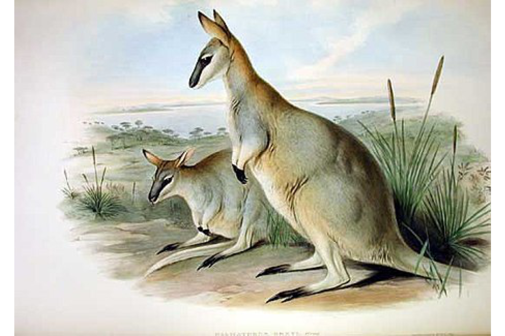
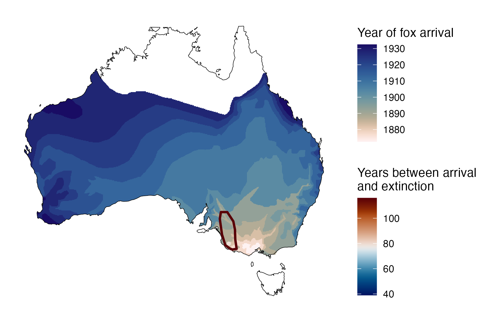
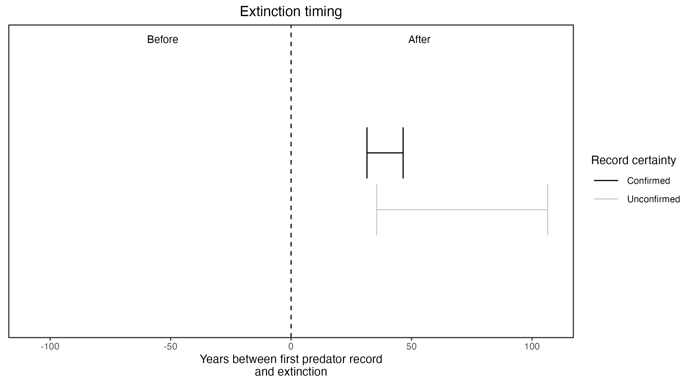

```{css, echo=FALSE}
h1, h2, h3 {
  text-align: center;
}
```

## **Toolache wallaby**
### *Notamacropus greyi*
### Blamed on foxes

:::: {style="display: flex;"}

::: {}

[](https://www.inaturalist.org/photos/136740?size=original)

:::

::: {}

:::

::: {}
  ```{r map, echo=FALSE, fig.cap="", out.width = '100%'}
  
  ```
:::

::::

<center>
IUCN status: **Extinct**

Last seen: *Notamacropus greyi were last seen in 1924 in Konetta Station, between Robe and Penola, SA (IUCN 2023)*

IUCN claim: *"The introduced red fox and hunting contributed to the extinction."*

</center>


### Studies in support

Toolache wallabies were last confirmed at Konetta Station 34-44 years after foxes arrived (Wallach et al. 2025).

### Studies not in support

No studies

### Is the threat claim evidence-based?

No studies were found evidencing a link between foxes and the extinction of toolache wallabies.
<br>
<br>



### References


Fairfax, Dispersal of the introduced red fox (Vulpes vulpes) across Australia. Biol. Invasions 21, 1259-1268 (2019).

IUCN Red List. https://www.iucnredlist.org/ Accessed June 2023

Wallach A.D., Lundgren E.J. (2025) Review of evidence that foxes and cats cause extinctions of Australia’s endemic mammals. BioScience. DOI: 10.1093/biosci/biaf046

