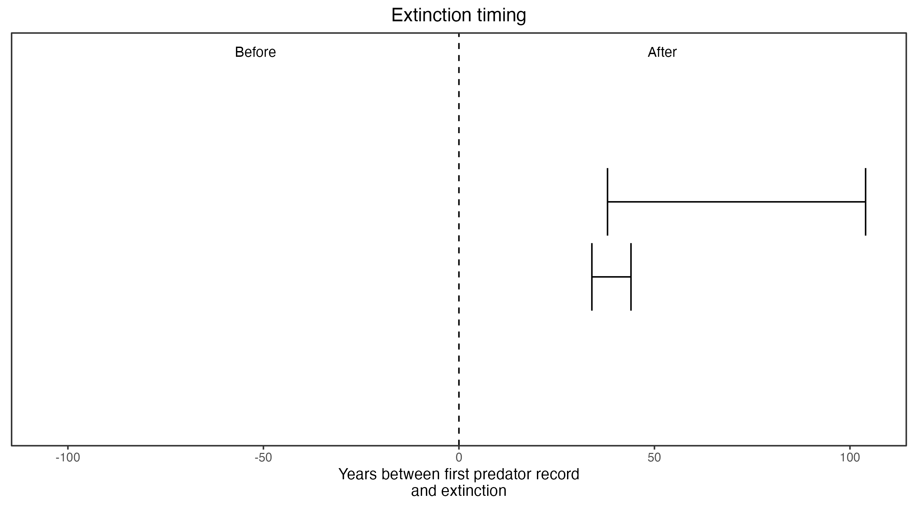

```{css, echo=FALSE}
h1, h2, h3 {
  text-align: center;
}
```

## **Toolache wallaby**
### *Notamacropus greyi*

:::: {style="display: flex;"}

::: {}
  ```{r icon, echo=FALSE, fig.cap="", out.width = '100%'}
  knitr::include_graphics("assets/phylopics/PLACEHOLDER_ready.png")
  ```
:::

::: {}

:::

::: {}
  ```{r map, echo=FALSE, fig.cap="", out.width = '100%'}
  knitr::include_graphics("assets/figures/Map_Fox_Notamacropus greyi.png")
  ```
:::

::::

<center>
IUCN Status: **Extinct**

Last Seen: *Notamacropus greyi were last seen in 1924 in Konetta Station, about halfway between Robe and Penola, SA*

</center>


### Studies in support

Toolache wallabies were last confirmed 38 years after foxes arrived (Wallach et al. 202X).

### Studies not in support

No studies

### Is the threat claim evidence-based?

There are no studies evidencing a link between foxes and the extinction of toolache wallabies.
<br>
<br>



### References

Wallach et al. 2023 In Submission

