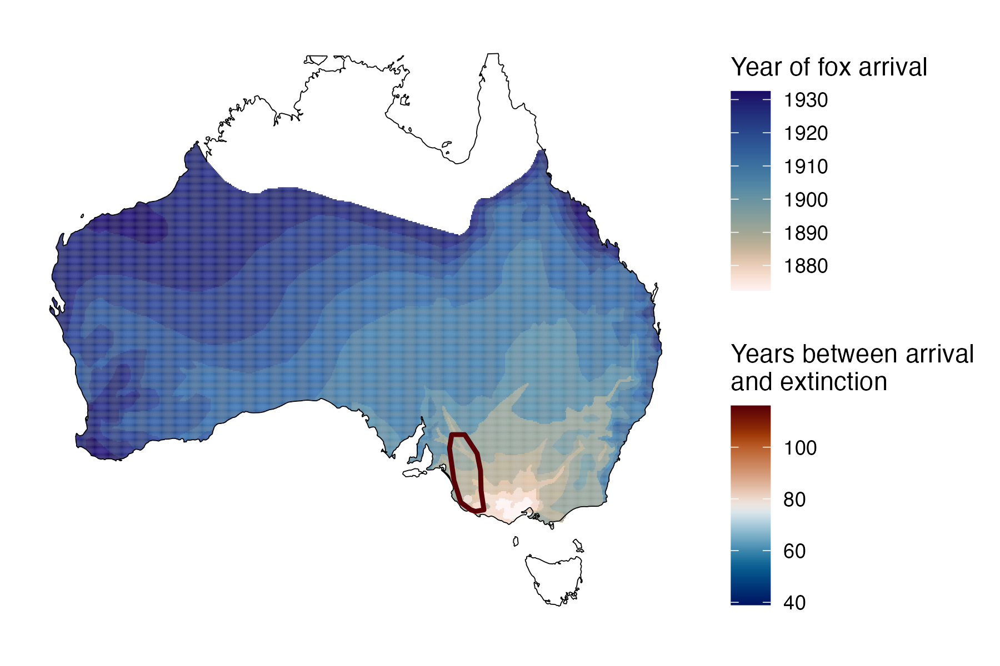

```{css, echo=FALSE}
h1, h2, h3 {
  text-align: center;
}
```

## **Toolache wallaby**
### *Notamacropus greyi*
### Blamed on foxes

:::: {style="display: flex;"}

::: {}

[](https://www.inaturalist.org/photos/136740?size=original)

:::

::: {}

:::

::: {}
  ```{r map, echo=FALSE, fig.cap="", out.width = '100%'}
  
  ```
:::

::::

<center>
IUCN status: **Extinct**

Last seen: *Notamacropus greyi were last seen in 1924 in Konetta Station, about halfway between Robe and Penola, SA*

</center>


### Studies in support

Toolache wallabies were last confirmed 38 years after foxes arrived (Current submission).

### Studies not in support

No studies

### Is the threat claim evidence-based?

There are no studies evidencing a link between foxes and the extinction of toolache wallabies.
<br>
<br>


### References

Current submission (2023) Scant evidence that introduced predators cause extinctions. Conservation Biology

Fairfax, Dispersal of the introduced red fox (Vulpes vulpes) across Australia. Biol. Invasions 21, 1259-1268 (2019).

