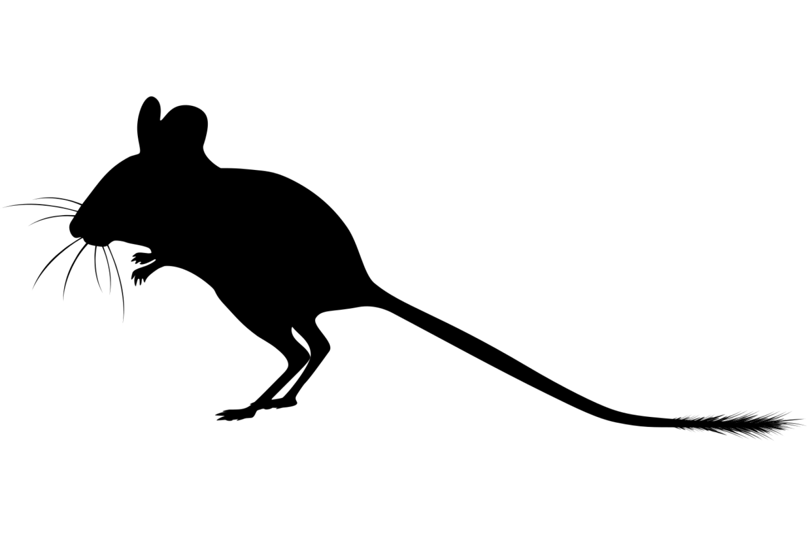
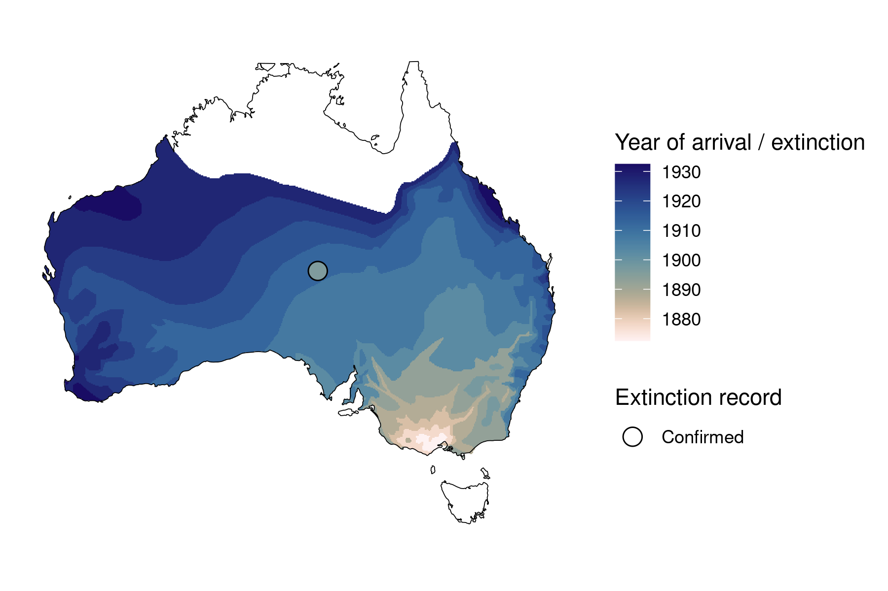
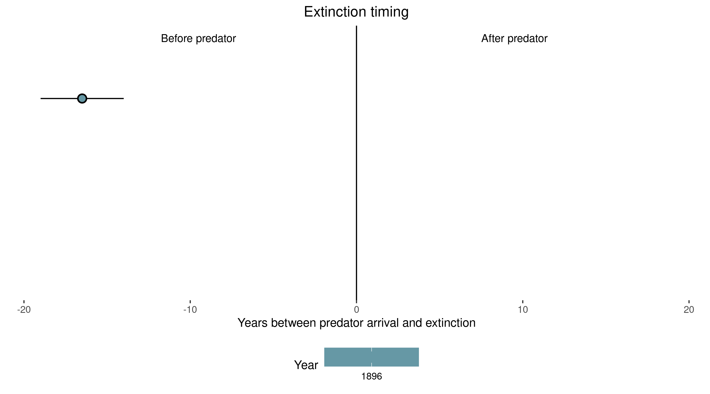

```{css, echo=FALSE}
h1, h2, h3 {
  text-align: center;
}
```

## **Short-tailed hopping mouse**
### *Notomys amplus*
### Blamed on foxes

:::: {style="display: flex;"}

::: {}



:::

::: {}

:::

::: {}
  ```{r map, echo=FALSE, fig.cap="", out.width = '100%'}
  
  ```
:::

::::

<center>
IUCN status: **Extinct**

Last seen: *Notomys amplus were last seen in 1896 in Charlotte Waters, NT*

</center>


### Studies in support

No studies

### Studies not in support

Short-tailed hopping mice were last confirmed 17 years before foxes arrived (Wallach et al. 202X).

### Is the threat claim evidence-based?

There are no studies evidencing a link between foxes and the extinction of short-tailed hopping mice. In contradiction with the claim, the extinction record pre-dates the fox arrival record.
<br>
<br>



### References

Fairfax, Dispersal of the introduced red fox (Vulpes vulpes) across Australia. Biol. Invasions 21, 1259-1268 (2019).

Wallach et al. 2023 In Submission

