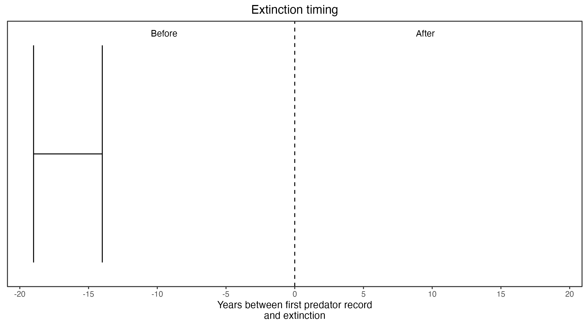

```{css, echo=FALSE}
h1, h2, h3 {
  text-align: center;
}
```

## **Short-tailed hopping mouse**
### *Notomys amplus*
### Blamed on foxes

:::: {style="display: flex;"}

::: {}


:::

::: {}

:::

::: {}
  ```{r map, echo=FALSE, fig.cap="", out.width = '100%'}
  knitr::include_graphics("assets/figures/Map_Fox_Notomys amplus.png")
  ```
:::

::::

<center>
IUCN status: **Extinct**

Last seen: *Notomys amplus were last seen in 1896 in Charlotte Waters, NT (IUCN 2023)*

IUCN claim: *"The reasons for the loss of this species are unknown, but may be related to predation by introduced species such as foxes and feral cats"*

</center>


### Studies in support

No studies

### Studies not in support

Short-tailed hopping mice were last confirmed at Charlotte Waters, NT, 19-14 years before foxes arrived (Current submission).

### Is the threat claim evidence-based?

No studies were found evidencing a link between foxes and the extinction of short-tailed hopping mice. The extinction record pre-dates the fox arrival record.
<br>
<br>



### References


Current submission (2023) Scant evidence that introduced predators cause extinctions.

Fairfax, Dispersal of the introduced red fox (Vulpes vulpes) across Australia. Biol. Invasions 21, 1259-1268 (2019).

IUCN Red List. https://www.iucnredlist.org/ Accessed June 2023

