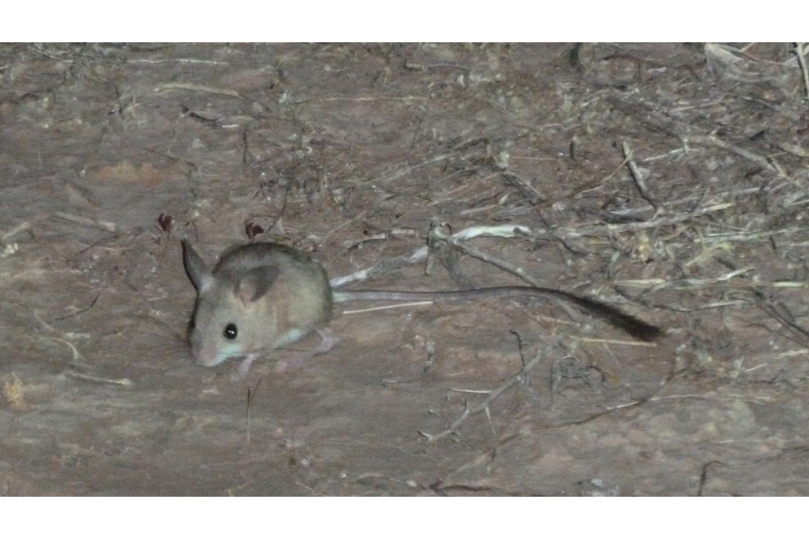
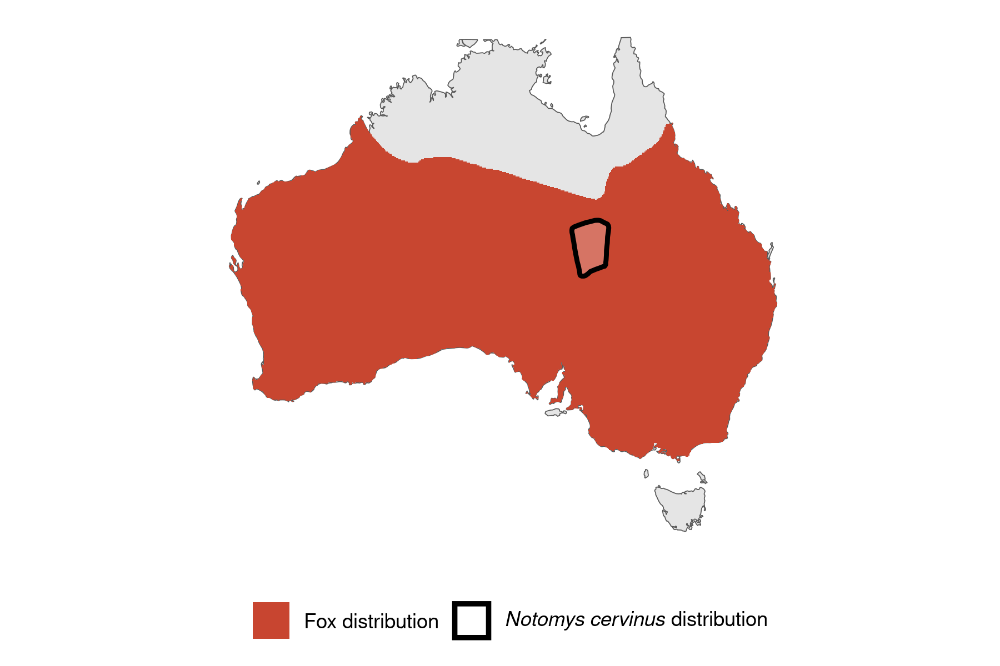

```{css, echo=FALSE}
h1, h2, h3 {
  text-align: center;
}
```

## **Fawn hopping mouse**
### *Notomys cervinus*
### Blamed on foxes

:::: {style="display: flex;"}

[](https://en.wikipedia.org/wiki/Fawn_hopping_mouse#/media/File:Fawn_hopping_mouse.jpg)

::: {}

:::

::: {}
  ```{r map, echo=FALSE, fig.cap="", out.width = '100%'}
  
  ```
:::

::::
<center>
IUCN status: **Near Threatened**

EPBC Predator Threat Rating: **Not assessed**

IUCN claim: *"The major threat is predation by feral Domestic Cats (Felis catus; moderate, entire range), Red Foxes (Vulpes vulpes; minor, entire range)"*

</center>

### Studies in support

No studies

### Studies not in support

No studies

### Is the threat claim evidence-based?

No studies were found linking foxes to fawn hopping mice.
<br>
<br>

![**Evidence linking *Notomys cervinus* to foxes.** Systematic review of evidence for an association between *Notomys cervinus* and foxes. Positive studies are in support of the hypothesis that *foxes* contribute to the decline of Notomys cervinus, negative studies are not in support. Predation studies include studies documenting hunting or scavenging; baiting studies are associations between poison baiting and threatened mammal abundance where information on predator abundance is not provided; population studies are associations between threatened mammal and predator abundance. See methods section in [current submission] for details on evidence categories.](assets/figures/Main_Evidence_Fox_Notomys cervinus.png)

### References


Current submission (2023) Scant evidence that introduced predators cause extinctions.

IUCN Red List. https://www.iucnredlist.org/ Accessed June 2023

