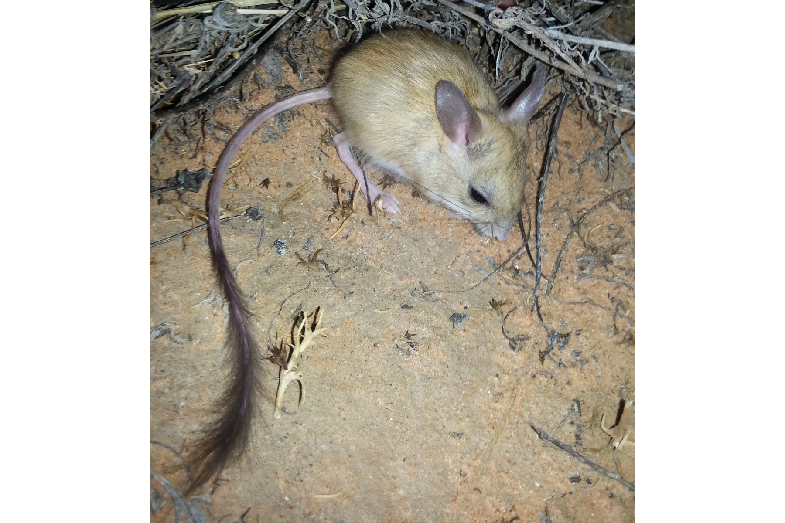
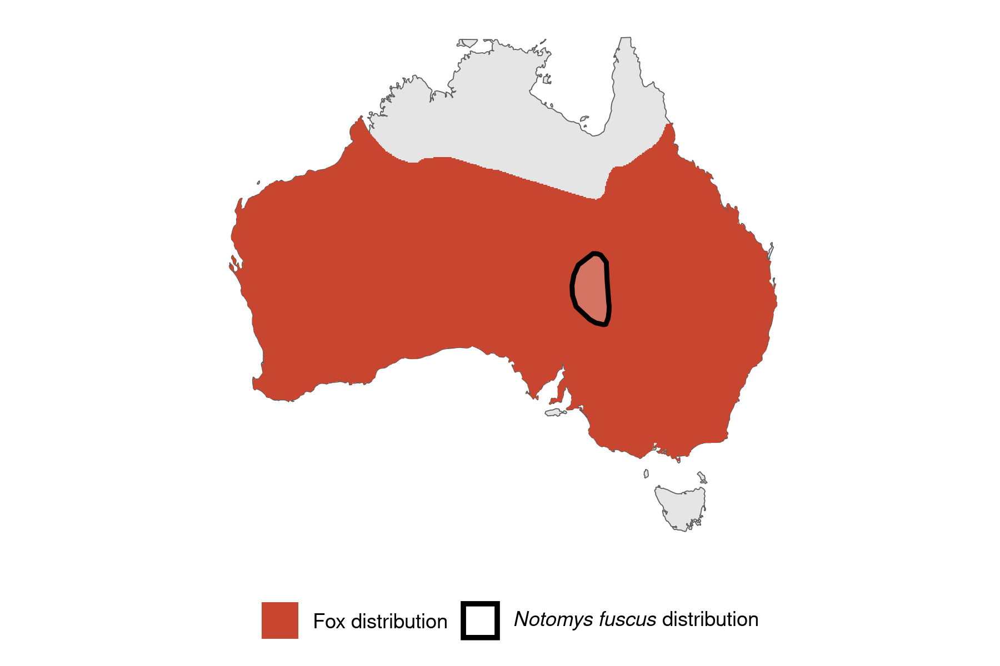

```{css, echo=FALSE}
h1, h2, h3 {
  text-align: center;
}
```

## **Dusky hopping mouse**
### *Notomys fuscus*
### Blamed on foxes

:::: {style="display: flex;"}

[](https://www.inaturalist.org/photos/62717923?size=original)

::: {}

:::

::: {}
  ```{r map, echo=FALSE, fig.cap="", out.width = '100%'}
  
  ```
:::

::::
<center>
IUCN Status: **Vulnerable**

EPBC Threat Rating: **N/A**

IUCN Claim: *"Predation by feral Domestic Cats (Felis catus; moderate to severe, across the entire range) and Red Foxes (Vulpes vulpes) represent another major threat'"*

</center>

### Studies in support

Gordon et al. (2015) found a negative correlation betwen fox abundance and hopping mouse abundance (Gordon et al. 2015). Similarly Letnic et al. (2009) found that negative correlation with fox abundance was the third most important predictor variable in a model (after positive correlation with dingoes and rain). Letnic & Koch (2010) reported higher fox abundance and lower hopping mouse abundance outside compared to inside the dingo barrier fence, but direct association not shown (Letnic & Koch 2010). Hopping mice have also been identified in the foxes' diet (Feit et al. 2019), and more often than in the dingo's diet (Letnic & Dworjanyn 2011).

### Studies not in support

Hopping mice were last confirmed in NSW 4 years before foxes arrived (Wallach et al. 202X).

### Is the threat claim evidence-based?

Foxes have been documented among a range of ecological variables negatively correlated with dusky hopping mouse abundance but cause of extirpation remains unknown. In contradiction with the claim the extirpation record pre-dates the fox arrival record.
<br>
<br>

![**Evidence linking *Notomys fuscus* to foxes.** **A.** Systematic review of evidence for an association between *Notomys fuscus* and foxes. Positive studies are in support of the hypothesis that foxes contribute to the decline of *Notomys fuscus*, negative studies are not in support. Predation studies include studies documenting hunting or scavenging; baiting studies are associations between poison baiting and threatened mammal abundance where information on predator abundance is not provided; population studies are associations between threatened mammal and predator abundance. **B.** Last records of extirpated populations relative to earliest local records of foxes. Error bars show record uncertainty range. Predator arrival records were digitized from Fairfax 2019.](assets/figures/Main_Evidence_Fox_Notomys fuscus.png)

### References

Fairfax, Dispersal of the introduced red fox (Vulpes vulpes) across Australia. Biol. Invasions 21, 1259-1268 (2019).

Feit, B., Feit, A. & Letnic, M. Apex Predators Decouple Population Dynamics Between Mesopredators and Their Prey. Ecosystems 22, 1606–1617 (2019). https://doi.org/10.1007/s10021-019-00360-2

Gordon, Christopher E., et al. "Mesopredator suppression by an apex predator alleviates the risk of predation perceived by small prey." Proceedings of the Royal Society B: Biological Sciences 282.1802 (2015): 20142870.

Letnic, M., M. S. Crowther, and F. Koch. "Does a top‐predator provide an endangered rodent with refuge from an invasive mesopredator?." Animal Conservation 12.4 (2009): 302-312

Letnic, Mike, and Freya Koch. "Are dingoes a trophic regulator in arid Australia? A comparison of mammal communities on either side of the dingo fence." Austral Ecology 35.2 (2010): 167-175.

Letnic, Mike, and Symon A. Dworjanyn. "Does a top predator reduce the predatory impact of an invasive mesopredator on an endangered rodent?." Ecography 34.5 (2011): 827-835

Wallach et al. 2023 In Submission

