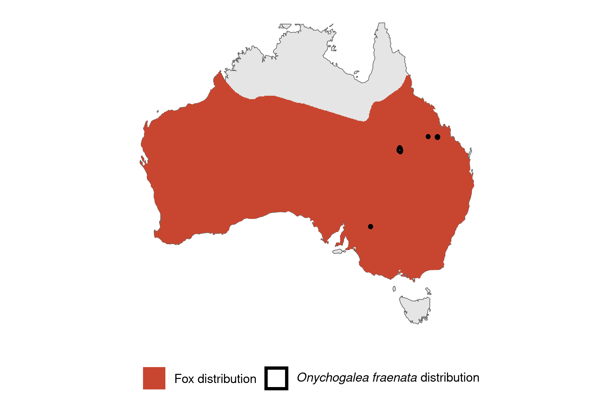

```{css, echo=FALSE}
h1, h2, h3 {
  text-align: center;
}
```

## **Bridled nail-tail wallaby**
### *Onychogalea fraenata*
### Blamed on foxes

:::: {style="display: flex;"}

[](https://www.inaturalist.org/photos/60047372?size=original)

::: {}

:::

::: {}
  ```{r map, echo=FALSE, fig.cap="", out.width = '100%'}
  
  ```
:::

::::
<center>
IUCN status: **Vulnerable**

EPBC Threat Rating: **Very high**

IUCN claim: *"The species is threatened by introduced predators, the Red Fox and feral Cat especially"*

</center>

### Studies in support

Foxes hunted 3 of 30 reintroduced, predator-inexperienced wallabies (Hayward et al. 2012).

### Studies not in support

Wallabies were last confirmed in NSW 3 years before foxes arrived (Table S2).

### Is the threat claim evidence-based?

There are no studies evidencing a link between foxes and nail-tail wallaby populations. In contradiction with the claim, the extirpation record pre-dates the fox arrival record.
<br>
<br>

![**Evidence linking *Onychogalea fraenata* to foxes.** **A.** Systematic review of evidence for an association between *Onychogalea fraenata* and foxes. Positive studies are in support of the hypothesis that foxes contribute to the decline of *Onychogalea fraenata*, negative studies are not in support. Predation studies include studies documenting hunting or scavenging; baiting studies are associations between poison baiting and threatened mammal abundance where information on predator abundance is not provided; population studies are associations between threatened mammal and predator abundance. **B.** Last records of extirpated populations relative to earliest local records of foxes. Error bars show record uncertainty range. Predator arrival records were digitized from Fairfax 2019.](assets/figures/Main_Evidence_Fox_Onychogalea fraenata.png)

### References

Current submission (2023) Scant evidence that introduced predators cause extinctions. Conservation Biology

EPBC. (2015) Threat Abatement Plan for Predation by Feral Cats. Environment Protection and Biodiversity Conservation Act 1999, Department of Environment, Government of Australia. (Table A1).

Fairfax, Dispersal of the introduced red fox (Vulpes vulpes) across Australia. Biol. Invasions 21, 1259-1268 (2019).

Hayward, M.W., L'Hotellier, F., O'Connor, T., Ward-Fear, G., Cathcart, J., Cathcart, T., Sephens, J., Stephens, J., Herman, K. and Legge, S., 2012, January. Reintroduction of bridled nailtail wallabies beyond fences at Scotia Sanctuary-Phase 1. In Proceedings of the Linnean Society of New South Wales (Vol. 134).

