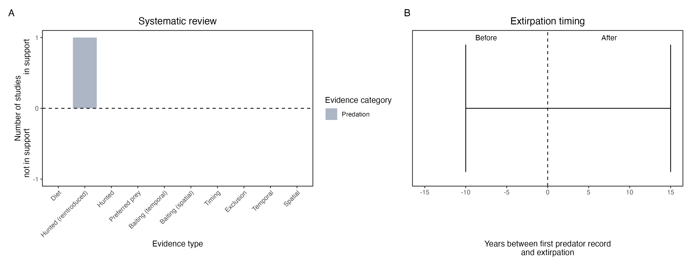

```{css, echo=FALSE}
h1, h2, h3 {
  text-align: center;
}
```

## **Bridled nail-tail wallaby**
### *Onychogalea fraenata*
### Blamed on foxes

:::: {style="display: flex;"}

::: {}
  ```{r icon, echo=FALSE, fig.cap="", out.width = '100%'}
  knitr::include_graphics("assets/phylopics/PLACEHOLDER_ready.png")
  ```
:::

::: {}

:::

::: {}
  ```{r map, echo=FALSE, fig.cap="", out.width = '100%'}
  knitr::include_graphics("assets/figures/Map_Fox_Onychogalea fraenata.png")
  ```
:::

::::
<center>
IUCN Status: **Vulnerable**

EPBC Threat Rating: **Very high**

IUCN Claim: *'The species is threatened by introduced predators, the Red Fox and feral Cat especially''*

</center>

### Studies in support

Foxes hunted 3 of 30 reintroduced, predator-inexperienced wallabies (Hayward et al. 2012).

### Studies not in support

Wallabies were last confirmed in NSW 3 years before foxes arrived (Table S2).

### Is the threat claim evidence-based?

There are no studies evidencing a link between foxes and nail-tail wallaby populations. In contradiction with the claim, the extirpation record pre-dates the fox arrival record.
<br>
<br>



### References

Hayward, Matt W., et al. "Reintroduction of bridled nailtail wallabies beyond fences at Scotia Sanctuary-Phase 1." Proceedings of the Linnean Society of New South Wales. Vol. 134. 2012.

Wallach et al. 2023 In Submission

