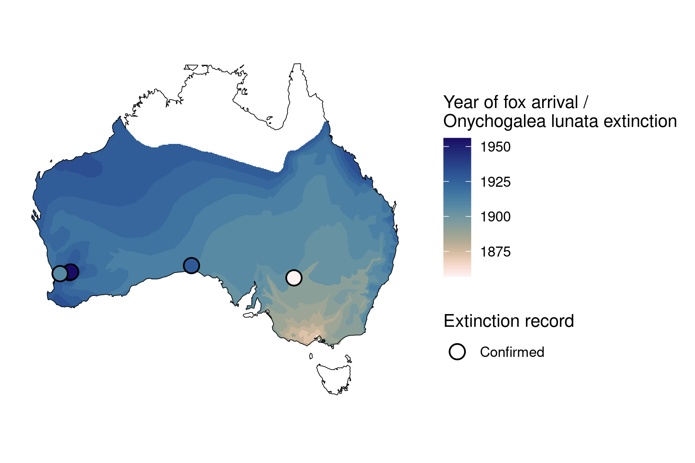

```{css, echo=FALSE}
h1, h2, h3 {
  text-align: center;
}
```

## **Crescent nail-tail wallaby**
### *Onychogalea lunata*
### Blamed on foxes

:::: {style="display: flex;"}

::: {}
  ```{r icon, echo=FALSE, fig.cap="", out.width = '100%'}
  knitr::include_graphics("assets/phylopics/PLACEHOLDER_ready.png")
  ```
:::

::: {}

:::

::: {}
  ```{r map, echo=FALSE, fig.cap="", out.width = '100%'}
  
  ```
:::

::::

<center>
IUCN Status: **Extinct**

Last Seen: *Onychogalea lunata were last seen in 1956 in Wheatbelt, WA*

</center>


### Studies in support

Crescent nail-tail wallabies were last confirmed in WA 15-31 years after foxes arrived (Wallach et al. 202X).

### Studies not in support

Crescent nail-tail wallabies were last confirmed in south-west WA and NSW 18 and 47 years before foxes arrived (Wallach et al. 202X).

### Is the threat claim evidence-based?

There are no studies evidencing a link between foxes and the extinction of crescent nail-tail wallabies. In contradiction with the claim, the extinction records from south-west WA and NSW pre-date the fox arrival record.
<br>
<br>


### References

Fairfax, Dispersal of the introduced red fox (Vulpes vulpes) across Australia. Biol. Invasions 21, 1259-1268 (2019).

Wallach et al. 2023 In Submission

