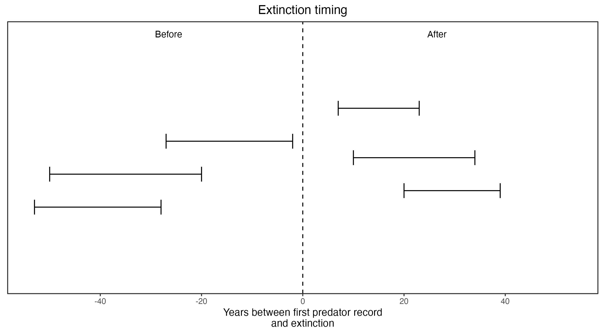

```{css, echo=FALSE}
h1, h2, h3 {
  text-align: center;
}
```

## **Crescent nail-tail wallaby**
### *Onychogalea lunata*
### Blamed on foxes

:::: {style="display: flex;"}

::: {}

[](https://www.inaturalist.org/photos/136739?size=original)

:::

::: {}

:::

::: {}
  ```{r map, echo=FALSE, fig.cap="", out.width = '100%'}
  knitr::include_graphics("assets/figures/Map_Fox_Onychogalea lunata.png")
  ```
:::

::::

<center>
IUCN status: **Extinct**

Last seen: *Onychogalea lunata were last seen in 1952 (1950-1954) in Wheatbelt, WA (IUCN 2023)*

IUCN claim: *"This species was probably extirpated by predation from introduced foxes and cats."*

</center>


### Studies in support

Crescent nail-tail wallabies were last confirmed in the Wheatbelt (two records) and Nullarbor 10-39 and 7-23 years after foxes arrived, respectively (Current submission).

### Studies not in support

Crescent nail-tail wallabies were last confirmed in western NSW (two records) and southwest WA 53-20 and 27-2 years before foxes arrived, respectively (Current submission).

### Is the threat claim evidence-based?

No studies were found evidencing a link between foxes and the extinction of crescent nail-tail wallabies. In two regions the extirpation records pre-date the fox arrival records.
<br>
<br>



### References


Current submission (2023) Scant evidence that introduced predators cause extinctions.

Fairfax, Dispersal of the introduced red fox (Vulpes vulpes) across Australia. Biol. Invasions 21, 1259-1268 (2019).

IUCN Red List. https://www.iucnredlist.org/ Accessed June 2023

