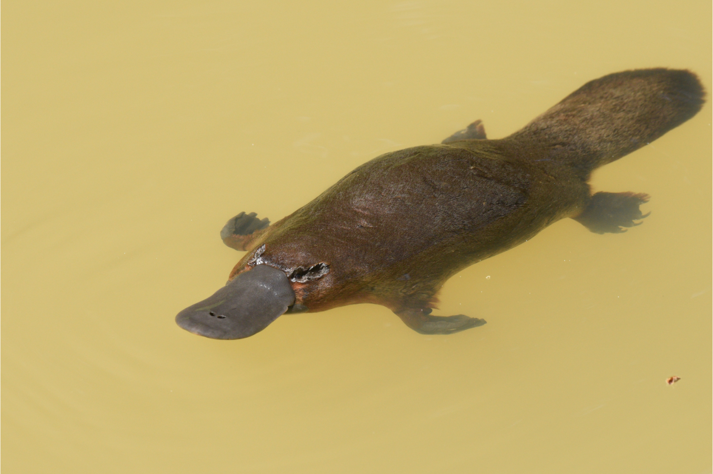
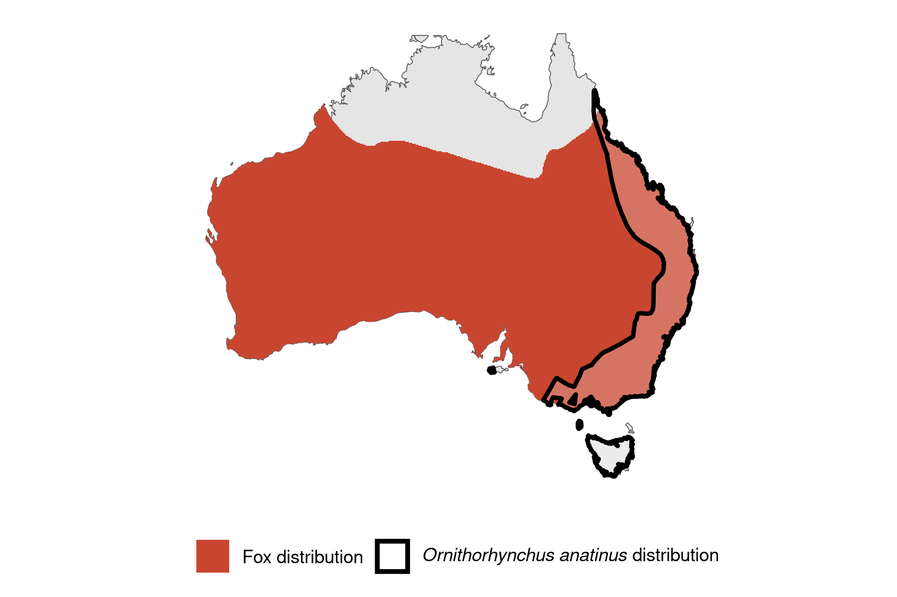

```{css, echo=FALSE}
h1, h2, h3 {
  text-align: center;
}
```

## **Platypus**
### *Ornithorhynchus anatinus*
### Blamed on foxes

:::: {style="display: flex;"}

[](https://www.inaturalist.org/photos/187603213?size=original)

::: {}

:::

::: {}
  ```{r map, echo=FALSE, fig.cap="", out.width = '100%'}
  
  ```
:::

::::
<center>
IUCN status: **Near Threatened**

EPBC Predator Threat Rating: **Not assessed**

IUCN claim: *"Across its range, the Platypus is also subject to predation by the introduced Red Fox, dogs and cats."*

</center>

### Studies in support

Platypus were found in fox scats (Brown 1990; Green 2003; Purcell 2008; Davis et al. 2015).

### Studies not in support

No studies

### Is the threat claim evidence-based?

There are no studies linking foxes to platypus populations.
<br>
<br>

![**Evidence linking *Ornithorhynchus anatinus* to foxes.** Systematic review of evidence for an association between *Ornithorhynchus anatinus* and foxes. Positive studies are in support of the hypothesis that *foxes* contribute to the decline of Ornithorhynchus anatinus, negative studies are not in support. Predation studies include studies documenting hunting or scavenging; baiting studies are associations between poison baiting and threatened mammal abundance where information on predator abundance is not provided; population studies are associations between threatened mammal and predator abundance. See methods section in [current submission] for details on evidence categories.](assets/figures/Main_Evidence_Fox_Ornithorhynchus anatinus.png)

### References

Brown, G.W., 1990. Diets of wild canids and foxes in East Gippsland 1983–1987, using predator scat analysis. Australian Mammalogy, 13(2), pp.209-213.

Current submission (2023) Scant evidence that introduced predators cause extinctions.

Davis, N.E., Forsyth, D.M., Triggs, B., Pascoe, C., Benshemesh, J., Robley, A., Lawrence, J., Ritchie, E.G., Nimmo, D.G. and Lumsden, L.F., 2015. Interspecific and geographic variation in the diets of sympatric carnivores: dingoes/wild dogs and red foxes in south-eastern Australia. PloS One, 10(3), p.e0120975.

Green, K., 2003. Altitudinal and temporal differences in the food of foxes (Vulpes vulpes) at alpine and subalpine altitudes in the Snowy Mountains. Wildlife Research, 30(3), pp.245-253.

IUCN Red List. https://www.iucnredlist.org/ Accessed June 2023

Purcell, B.V., 2008. Order in the pack: ecology of Canis lupus dingo in the southern Greater Blue Mountains World Heritage Area. PhD Thesis, School of Natural Sciences, University of Western Sydney.

