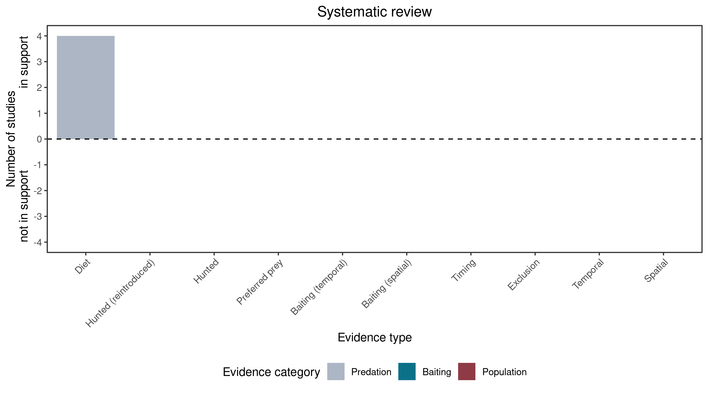

```{css, echo=FALSE}
h1, h2, h3 {
  text-align: center;
}
```

## **Platypus**
### *Ornithorhynchus anatinus*

:::: {style="display: flex;"}

::: {}
  ```{r icon, echo=FALSE, fig.cap="", out.width = '100%'}
  knitr::include_graphics("assets/phylopics/PLACEHOLDER_ready.png")
  ```
:::

::: {}

:::

::: {}
  ```{r map, echo=FALSE, fig.cap="", out.width = '100%'}
  knitr::include_graphics("assets/figures/Map_Fox_Ornithorhynchus anatinus.png")
  ```
:::

::::
<center>
IUCN Status: **Near Threatened**

EPBC Threat Rating: **N/A**

IUCN Claim: *Across its range, the Platypus is also subject to predation by the introduced Red Fox, dogs and cats.'*

</center>

### Studies in support

Platypus were found in fox scats (Brown 1990; Green 2003; Purcell 2008; Davis et al. 2015).

### Studies not in support

No studies

### Is the threat claim evidence-based?

There are no studies linking foxes to platypus populations.
<br>
<br>



### References

Purcell, Brad V. "Order in the pack: ecology of Canis lupus dingo in the southern Greater Blue Mountains World Heritage Area." (2008).

Green, K. (2003). Altitudinal and temporal differences in the food of foxes (Vulpes vulpes) at alpine and subalpine altitudes in the Snowy Mountains. Wildlife Research, 30(3), 245. doi:10.1071/wr02008 

Brown G.W. (1990) Diets of wild canids and foxes in East Gippsland 1983–1987, using predator scat analysis.. Australian Mammalogy 13, 209-213.

Davis NE, Forsyth DM, Triggs B, Pascoe C, Benshemesh J, Robley A, et al. (2015) Interspecific and Geographic Variation in the Diets of Sympatric Carnivores: Dingoes/Wild Dogs and Red Foxes in South-Eastern Australia. PLoS ONE 10(3): e0120975. https://doi.org/10.1371/journal.pone.0120975

Wallach et al. 2023 In Submission

