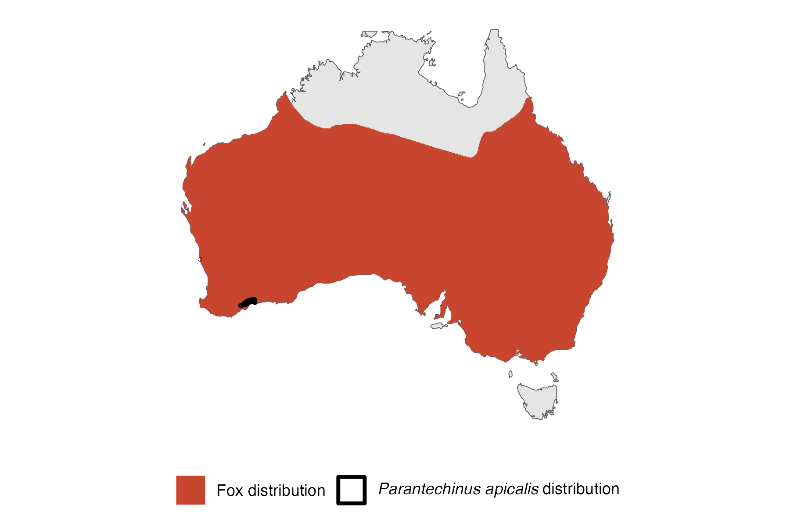

```{css, echo=FALSE}
h1, h2, h3 {
  text-align: center;
}
```

## **Dibbler**
### *Parantechinus apicalis*
### Blamed on foxes

:::: {style="display: flex;"}

::: {}
  ```{r icon, echo=FALSE, fig.cap="", out.width = '100%'}
  knitr::include_graphics("assets/phylopics/PLACEHOLDER_ready.png")
  ```
:::

::: {}

:::

::: {}
  ```{r map, echo=FALSE, fig.cap="", out.width = '100%'}
  
  ```
:::

::::
<center>
IUCN Status: **Endangered**

EPBC Threat Rating: **High**

IUCN Claim: *'Introduced foxes and cats are known to prey on this species''*

</center>

### Studies in support

Foxes hunt dibblers (Friend 2003). Friend (2003) also stated that  dibbler decline coincides with fox establishment but no data was provided. Dibblers were detected after several years of an intensive poison baiting campaign (Kinnear et al. 2002).

### Studies not in support

No studies

### Is the threat claim evidence-based?

There are no studies evidencing a negative association between foxes and dibbler populations that analyse data.
<br>
<br>

![**Fig. 1**  Systematic review of evidence for an association between *Parantechinus apicalis* and foxes. Positive studies are in support of the hypothesis that foxes contribute to the decline of Parantechinus apicalis, negative studies are not in support. Predation studies include studies documenting hunting or scavenging; baiting studies are associations between poison baiting and threatened mammal abundance where information on predator abundance is not provided; population studies are associations between threatened mammal and predator abundance.](assets/figures/Main_Evidence_Fox_Parantechinus apicalis.png)

### References

Friend T. 2003. Dibbler (Parantechinus apicalis) Recovery Plan July 2003–June 2013. Wildlife Management Program.

Kinnear, J. E., N. R. Sumner, and M. L. Onus. "The red fox in Australia—an exotic predator turned biocontrol agent." Biological Conservation 108.3 (2002): 335-359.

Wallach et al. 2023 In Submission

