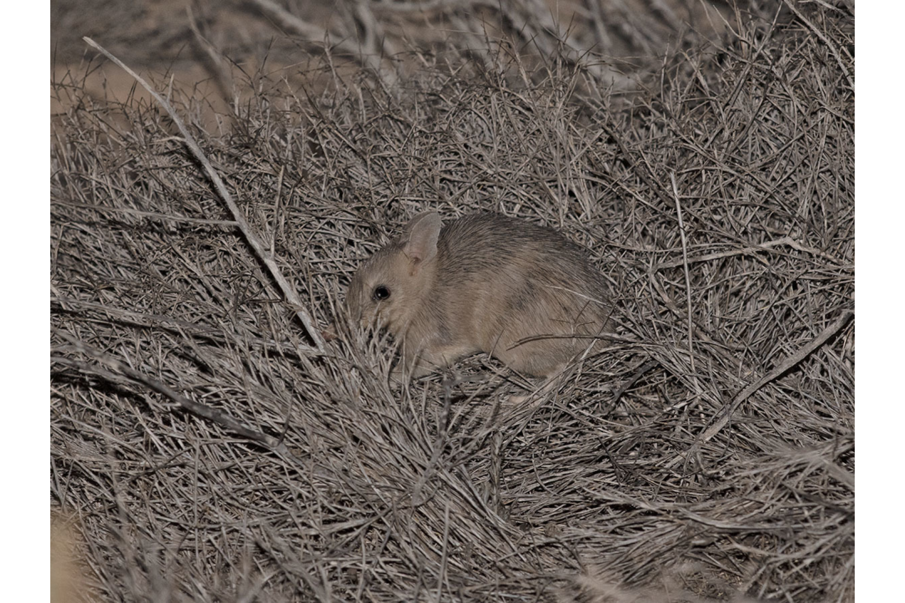
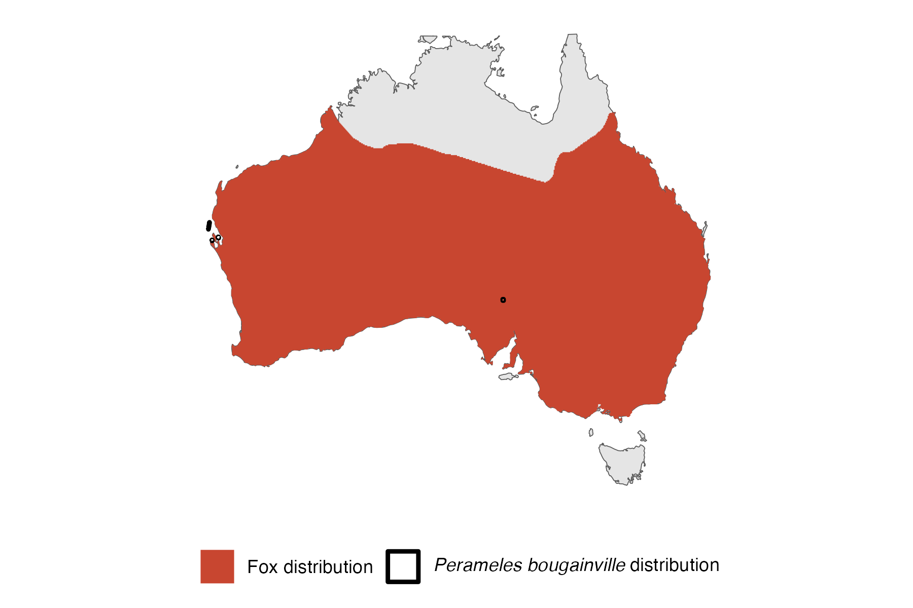

```{css, echo=FALSE}
h1, h2, h3 {
  text-align: center;
}
```

## **Western barred bandicoot**
### *Perameles bougainville*
### Blamed on foxes

:::: {style="display: flex;"}

[](https://www.inaturalist.org/photos/96420107?size=original)

::: {}

:::

::: {}
  ```{r map, echo=FALSE, fig.cap="", out.width = '100%'}
  
  ```
:::

::::
<center>
IUCN status: **Vulnerable**

EPBC Threat Rating: **Moderate**

IUCN claim: *"The current major threats to the natural subpopulations of the species include: the accidental introduction of predators (introduced cats and foxes)"*

</center>

### Studies in support

Bandicoots were reintroduced successfully into a fenced reserve which excluded foxes (Richards & Short 2003). Richards (2012) argued that the incursion of foxes into a fenced reserve led to population declines, but no data was provided. Bandicoots were last confirmed in the Nullarbor, WA and SA 14-26 years after foxes arrived (Wallach et al 202X).

### Studies not in support

Bandicoots were last confirmed in NSW and south-west WA 20-46 years before foxes arrived (Wallach et al. In Submission).

### Is the threat claim evidence-based?

There are no studies evidencing a negative association between foxes and western barred bandicoot populations. The fate of reintroduced animals is not a reliable proxy for the fate of populations. In contradiction with the claim, two extirpation records pre-date the fox arrival records.
<br>
<br>

![**Evidence linking *Perameles bougainville* to foxes.** **A.** Systematic review of evidence for an association between *Perameles bougainville* and foxes. Positive studies are in support of the hypothesis that foxes contribute to the decline of *Perameles bougainville*, negative studies are not in support. Predation studies include studies documenting hunting or scavenging; baiting studies are associations between poison baiting and threatened mammal abundance where information on predator abundance is not provided; population studies are associations between threatened mammal and predator abundance. **B.** Last records of extirpated populations relative to earliest local records of foxes. Error bars show record uncertainty range. Predator arrival records were digitized from Fairfax 2019.](assets/figures/Main_Evidence_Fox_Perameles bougainville.png)

### References


EPBC. (2015) Threat Abatement Plan for Predation by Feral Cats. Environment Protection and Biodiversity Conservation Act 1999, Department of Environment, Government of Australia. (Table A1).

Fairfax, Dispersal of the introduced red fox (Vulpes vulpes) across Australia. Biol. Invasions 21, 1259-1268 (2019).

Wallach et al. 2023 In Submission

