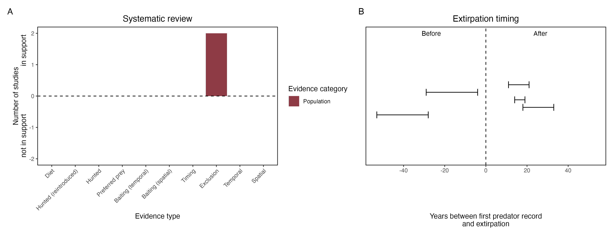

```{css, echo=FALSE}
h1, h2, h3 {
  text-align: center;
}
```

## **Western barred bandicoot**
### *Perameles bougainville*
### Blamed on foxes

:::: {style="display: flex;"}

::: {}
  ```{r icon, echo=FALSE, fig.cap="", out.width = '100%'}
  knitr::include_graphics("assets/phylopics/PLACEHOLDER_ready.png")
  ```
:::

::: {}

:::

::: {}
  ```{r map, echo=FALSE, fig.cap="", out.width = '100%'}
  
  ```
:::

::::
<center>
IUCN Status: **Vulnerable**

EPBC Threat Rating: **Moderate**

IUCN Claim: *'The current major threats to the natural subpopulations of the species include: the accidental introduction of predators (introduced cats and foxes)''*

</center>

### Studies in support

Bandicoots were reintroduced successfully into a fenced reserve which excluded foxes (Richards & Short 2003). Richards (2012) argued that the incursion of foxes into a fenced reserve led to population declines, but no data was provided. Bandicoots were last confirmed in the Nullarbor, WA and SA 14-26 years after foxes arrived (Wallach et al 202X).

### Studies not in support

Bandicoots were last confirmed in NSW and south-west WA 20-46 years before foxes arrived (Wallach et al. 202X).

### Is the threat claim evidence-based?

There are no studies evidencing a negative association between foxes and western barred bandicoot populations. The fate of reintroduced animals is not a reliable proxy for the fate of populations. In contradiction with the claim, two extirpation records pre-date the fox arrival records.
<br>
<br>



### References


Wallach et al. 2023 In Submission

