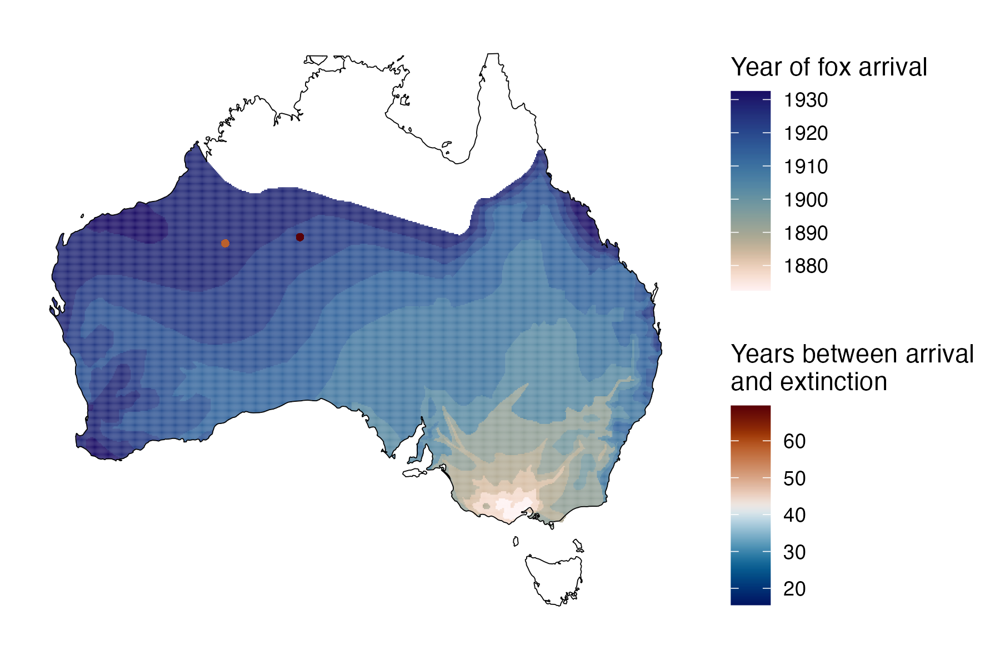

```{css, echo=FALSE}
h1, h2, h3 {
  text-align: center;
}
```

## **Desert bandicoot**
### *Perameles eremiana*
### Blamed on foxes

:::: {style="display: flex;"}

::: {}

[](https://en.wikipedia.org/wiki/Desert_bandicoot#/media/File:Perameles_eremiana.jpg)

:::

::: {}

:::

::: {}
  ```{r map, echo=FALSE, fig.cap="", out.width = '100%'}
  
  ```
:::

::::

<center>
IUCN status: **Extinct**

Last seen: *Perameles eremiana were last seen in 1943 at well 33, Canning Stock Route (IUCN 2023)*

IUCN claim: *"Its population decline was probably due to introduced predators: cats and foxes."*

</center>


### Studies in support

Desert bandicoots were last confirmed at the Canning Stock Route 13-18 years after foxes arrived (Current submission).

### Studies not in support

No studies

### Is the threat claim evidence-based?

No studies were found evidencing a link between foxes and the extinction of desert bandicoots.
<br>
<br>


### References


Current submission (2023) Scant evidence that introduced predators cause extinctions.

Fairfax, Dispersal of the introduced red fox (Vulpes vulpes) across Australia. Biol. Invasions 21, 1259-1268 (2019).

IUCN Red List. https://www.iucnredlist.org/ Accessed June 2023

