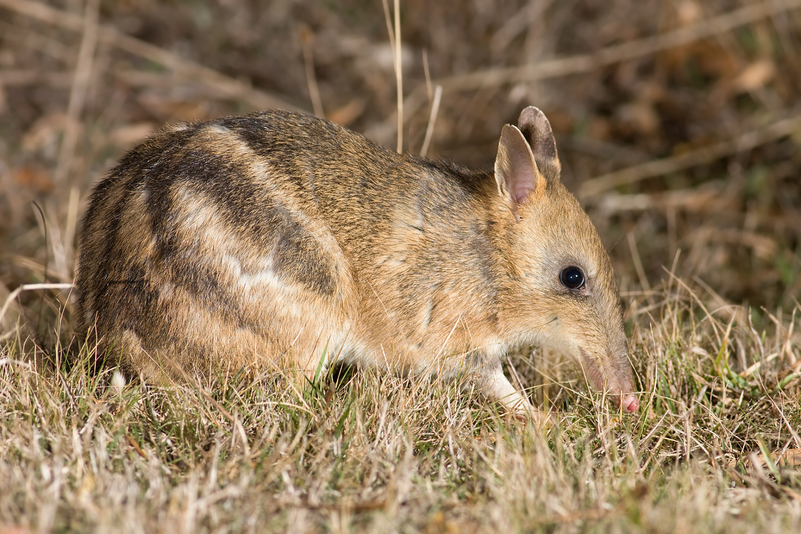

```{css, echo=FALSE}
h1, h2, h3 {
  text-align: center;
}
```

## **Eastern barred bandicoot**
### *Perameles gunnii*
### Blamed on foxes

:::: {style="display: flex;"}

[](https://www.inaturalist.org/photos/470373?size=original)

::: {}

:::

::: {}
  ```{r map, echo=FALSE, fig.cap="", out.width = '100%'}
  knitr::include_graphics("assets/figures/Map_Fox_Perameles gunnii.png")
  ```
:::

::::
<center>
IUCN status: **Vulnerable**

EPBC Threat Rating: **Moderate**

IUCN claim: *"Eastern Barred Bandicoots probably disappeared from the mainland due to introduced predators and habitat destruction from introduced herbivores. Predation from red foxes is thought to have been particularly detrimental, and the recent introduction of foxes to Tasmania could pose a major threat to the species here. "*

</center>

### Studies in support

Bandicoot abundance was positively correlated with a measure of predator control activities but not with fox abundance (Cook et al. 2010). Foxes were among predators of predator-inexperienced reintroduced bandicoots (Lenghaus et al. 1990; Winnard & Coulson 2008).

### Studies not in support

Cook et al. (2010) found no correlation between fox and bandicoot abundance. Long et al. (2005) reported that foxes remained common and unaffected by poison-baiting where a group of predator-inexperienced bandicoots were reintroduced; that no bandicoots were known to be hunted by foxes; and that no bandicoot remains were found in fox scats. Bandicoots co-occurred with foxes on the mainland for 115 years (Current submission).

### Is the threat claim evidence-based?

There are no studies evidence a negative association between foxes and eastern barred bandicoot populations. Poison-baiting is not a reliable proxy of fox abundance. In contradiction with the claim, the two species co-occurred for over a century.
<br>
<br>

![**Evidence linking *Perameles gunnii* to foxes.** **A.** Systematic review of evidence for an association between *Perameles gunnii* and foxes. Positive studies are in support of the hypothesis that foxes contribute to the decline of *Perameles gunnii*, negative studies are not in support. Predation studies include studies documenting hunting or scavenging; baiting studies are associations between poison baiting and threatened mammal abundance where information on predator abundance is not provided; population studies are associations between threatened mammal and predator abundance. **B.** Last records of extirpated populations relative to earliest local records of foxes. Error bars show record uncertainty range. Predator arrival records were digitized from Fairfax 2019.](assets/figures/Main_Evidence_Fox_Perameles gunnii.png)

### References

Cook, C.N., Morgan, D.G. and Marshall, D.J., 2010. Reevaluating suitable habitat for reintroductions: lessons learnt from the eastern barred bandicoot recovery program. Animal Conservation, 13(2), pp.184-195.

Current submission (2023) Scant evidence that introduced predators cause extinctions. Conservation Biology

EPBC. (2015) Threat Abatement Plan for Predation by Feral Cats. Environment Protection and Biodiversity Conservation Act 1999, Department of Environment, Government of Australia. (Table A1).

Fairfax, Dispersal of the introduced red fox (Vulpes vulpes) across Australia. Biol. Invasions 21, 1259-1268 (2019).

Lenghaus, C., Obendorf, D.L. and Wright, F.H., 1990. Veterinary aspects of Perameles gunnii biology with special reference to species conservation. Management and Conservation of Small Populations. Chicago Zoological Society, Brookfield, Illinois, pp.89-108.

Long, K., A. J. Robley, and K. Lovett. 2005. Immediate post-release survival of eastern barred bandicoots Perameles gunnii at Woodlands Historic Park, Victoria, with reference to fox activity. Australian Mammalogy 27.1: 17-25

Winnard, A.L. and Coulson, G., 2008. Sixteen years of Eastern Barred Bandicoot Perameles gunnii reintroductions in Victoria: a review. Pacific Conservation Biology, 14(1), pp.34-53.

