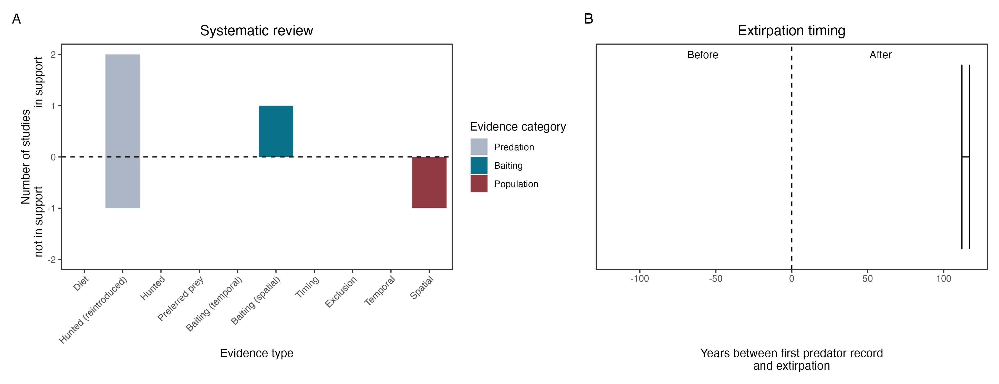

```{css, echo=FALSE}
h1, h2, h3 {
  text-align: center;
}
```

## **Eastern barred bandicoot**
### *Perameles gunnii*

:::: {style="display: flex;"}

::: {}
  ```{r icon, echo=FALSE, fig.cap="", out.width = '100%'}
  knitr::include_graphics("assets/phylopics/PLACEHOLDER_ready.png")
  ```
:::

::: {}

:::

::: {}
  ```{r map, echo=FALSE, fig.cap="", out.width = '100%'}
  
  ```
:::

::::
<center>
IUCN Status: **Vulnerable**

EPBC Threat Rating: **Moderate**

IUCN Claim: *Eastern Barred Bandicoots probably disappeared from the mainland due to introduced predators and habitat destruction from introduced herbivores. Predation from red foxes is thought to have been particularly detrimental, and the recent introduction of foxes to Tasmania could pose a major threat to the species here. '*

</center>

### Studies in support

Bandicoot abundance was positively correlated with a measure of predator control activities but not with fox abundance (Cook et al. 2010). Foxes were among predators of predator-inexperienced reintroduced bandicoots (Lenghaus et al. 1990; Winnard & Coulson 2008).

### Studies not in support

Cook et al. (2010) found no correlation between fox and bandicoot abundance. Long et al. (2005) reported that foxes remained common and unaffected by poison-baiting where a group of predator-inexperienced bandicoots were reintroduced; that no bandicoots were known to be hunted by foxes; and that no bandicoot remains were found in fox scats. Bandicoots co-occurred with foxes on the mainland for 115 years (Wallach et al. 202X).

### Is the threat claim evidence-based?

There are no studies evidence a negative association between foxes and eastern barred bandicoot populations. Poison baiting is not a reliable proxy of fox abundance. In contradiction with the claim, the two species co-occurred for over a century.
<br>
<br>



### References

Cook, C. N., D. G. Morgan, and D. J. Marshall. "Reevaluating suitable habitat for reintroductions: lessons learnt from the eastern barred bandicoot recovery program." Animal Conservation 13.2 (2010): 184-195.

Lenghaus, Cornelis, David L. Obendorf, and Frank H. Wright. "Veterinary aspects of Perameles gunnii biology with special reference to species conservation." Management and Conservation of Small Populations. Chicago Zoological Society, Brookfield, Illinois (1990): 89-108.

Winnard, Amy L., and Graeme Coulson. "Sixteen years of Eastern Barred Bandicoot Perameles gunnii reintroductions in Victoria: a review." Pacific Conservation Biology 14.1 (2008): 34-53.

Long, K., A. J. Robley, and K. Lovett. "Immediate post-release survival of eastern barred bandicoots Perameles gunnii at Woodlands Historic Park, Victoria, with reference to fox activity." Australian Mammalogy 27.1 (2005): 17-25

Wallach et al. 2023 In Submission

