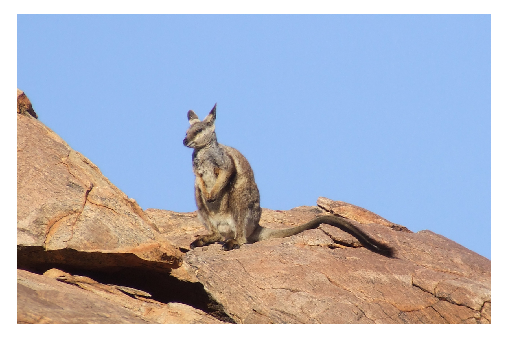
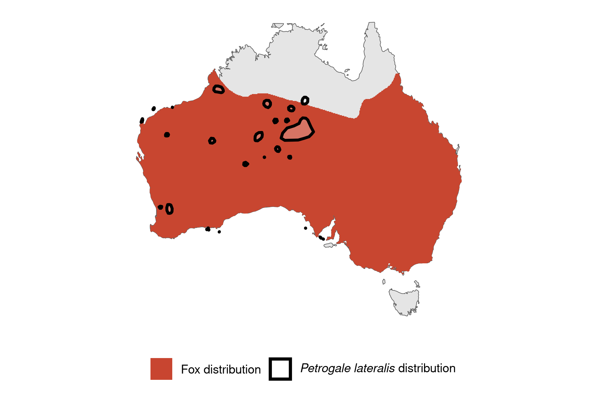

```{css, echo=FALSE}
h1, h2, h3 {
  text-align: center;
}
```

## **Black-footed rock-wallaby**
### *Petrogale lateralis*
### Blamed on foxes

:::: {style="display: flex;"}

[](Arian Wallach)

::: {}

:::

::: {}
  ```{r map, echo=FALSE, fig.cap="", out.width = '100%'}
  
  ```
:::

::::
<center>
IUCN Status: **Vulnerable**

EPBC Threat Rating: **Extreme**

IUCN Claim: *"The main threat overall to this species on the mainland is predation from introduced Red Foxes, and foxes are known to have played a major role in the decline of the species historically. Predation by feral cats is also occurring.'"*

</center>

### Studies in support

Intensification of poison-baiting in 1982 at two wallaby colonies was associated with population increase until 2008, while three colonies not intensively baited remained stable or declined between 1982-1990 (Kinnear et al. 1988; Kinnear et al. 1998; Kinnear et al. 2010). By 2011 the two intensely poisoned colonies collapsed, one to below 1982 levels (Kinnear et al. 2016), and the decision was made to fence one of the colonies (Pearson 2013).

### Studies not in support

Rock wallabies were not detected in the stomach contents of 14 foxes (Read et al. 2018). It was estimated that there were <150 wallabies across a region that was poison-baited every two weeks (Pearson 2013).

### Is the threat claim evidence-based?

There are no studies evidencing a negative association between foxes and black-footed rock-wallaby populations. poison-baiting is not a reliable proxy for fox abundance.
<br>
<br>

![**Evidence linking *Petrogale lateralis* to foxes.** Systematic review of evidence for an association between *Petrogale lateralis* and foxes. Positive studies are in support of the hypothesis that *foxes* contribute to the decline of Petrogale lateralis, negative studies are not in support. Predation studies include studies documenting hunting or scavenging; baiting studies are associations between poison baiting and threatened mammal abundance where information on predator abundance is not provided; population studies are associations between threatened mammal and predator abundance.](assets/figures/Main_Evidence_Fox_Petrogale lateralis.png)

### References

Kinnear J, Onus M, Sumner NR. 1998. Fox control and rock-wallaby population dynamics—II. An update. Wildlife Research 25:81-88.

Kinnear, J. E., Krebs, C. J., Pentland, C., Orell, P., Holme, C., and Karvinen, R. 2010. Predator-baiting experiments for the conservation of rock-wallabies in Western Australia: a 25-year review with recent advances. Wildlife Research 37: 57-67.

Kinnear, Jack E., M. L. Onus, and R. N. Bromilow. "Fox control and rock-wallaby population dynamics." Wildlife Research 15.4 (1988): 435-450.

Kinnear, Jean E., et al. "Fox control and 1080 baiting conundrums: time to prepare for a CRISPR solution." Australian Mammalogy 39.2 (2016): 127-136

Pearson D. 2013. Recovery plan for five species of rock wallabies: Black-footed rock wallaby (Petrogale lateralis), Rothschild rock wallaby (Petrogale rothschildi), Short-eared rock wallaby (Petrogale brachyotis), Monjon (Petrogale burbidgei) and Nabarlek (Petrogale concinna) 2012–2022. Department of Parks and Wildlife, Perth, WA.

Read, J. L., E. Dagg, and K. E. Moseby. "Prey selectivity by feral cats at central Australian rock-wallaby colonies." Australian Mammalogy 41.1 (2018): 132-141.

Wallach et al. 2023 In Submission

