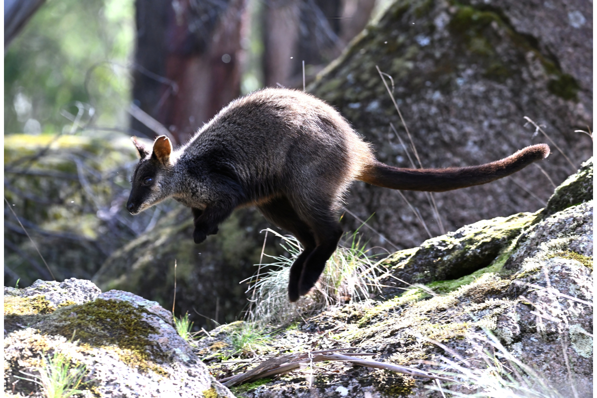

```{css, echo=FALSE}
h1, h2, h3 {
  text-align: center;
}
```

## **Brush-tailed rock-wallaby**
### *Petrogale penicillata*
### Blamed on foxes

:::: {style="display: flex;"}

[](https://www.inaturalist.org/photos/225455018?size=original)

::: {}

:::

::: {}
  ```{r map, echo=FALSE, fig.cap="", out.width = '100%'}
  
  ```
:::

::::
<center>
IUCN status: **Vulnerable**

EPBC Predator Threat Rating: **Very high**

IUCN claim: *"Predation by introduced foxes"*

</center>

### Studies in support

Wallaby remains were found in 1% of fox scats (Pascoe et al. 2012)and were found in another study (Sinclair 2020).

### Studies not in support

Wallaby remains were not found in fox scats where wallabies were common (Lunney et al. 1996).

### Is the threat claim evidence-based?

There are no studies linking foxes to brush-tailed rock-wallaby populations.
<br>
<br>

![**Evidence linking *Petrogale penicillata* to foxes.** Systematic review of evidence for an association between *Petrogale penicillata* and foxes. Positive studies are in support of the hypothesis that *foxes* contribute to the decline of Petrogale penicillata, negative studies are not in support. Predation studies include studies documenting hunting or scavenging; baiting studies are associations between poison baiting and threatened mammal abundance where information on predator abundance is not provided; population studies are associations between threatened mammal and predator abundance. See methods section in [current submission] for details on evidence categories.](assets/figures/Main_Evidence_Fox_Petrogale penicillata.png)

### References

Current submission (2023) Scant evidence that introduced predators cause extinctions.

EPBC. (2015) Threat Abatement Plan for Predation by Feral Cats. Environment Protection and Biodiversity Conservation Act 1999, Department of Environment, Government of Australia. (Table A1).

IUCN Red List. https://www.iucnredlist.org/ Accessed June 2023

Lunney, D., Law, B. and Rummery, C., 1996. Contrast between the visible abundance of the brush-tailed rock-wallaby, Petrogale penicillata, and its rarity in fox and dog scats in the gorges east of Armidale, New South Wales. Wildlife Research, 23(3), pp.373-379.

Pascoe, J.H., Mulley, R.C., Spencer, R. and Chapple, R., 2012. Diet analysis of mammals, raptors and reptiles in a complex predator assemblage in the Blue Mountains, eastern Australia. Australian Journal of Zoology, 59(5), pp.295-301.

Sinclair, R., 2020. The diet of foxes in the Grampians (Gariwerd) National Park. Doctoral dissertation, Deakin University.

