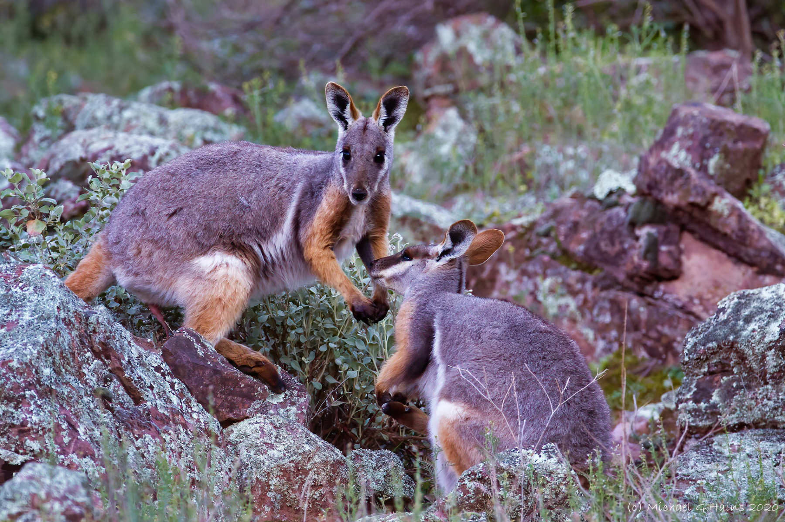

```{css, echo=FALSE}
h1, h2, h3 {
  text-align: center;
}
```

## **Yellow-footed rock-wallaby**
### *Petrogale xanthopus*
### Blamed on foxes

:::: {style="display: flex;"}

[](https://www.inaturalist.org/photos/60874978?size=original)

::: {}

:::

::: {}
  ```{r map, echo=FALSE, fig.cap="", out.width = '100%'}
  knitr::include_graphics("assets/figures/Map_Fox_Petrogale xanthopus.png")
  ```
:::

::::
<center>
IUCN status: **Near Threatened**

EPBC Predator Threat Rating: ****

IUCN claim: *"Predation from introduced foxes is the greatest threat to Yellow-footed Rock Wallabies (Lapidge and Henshall 2001)."*

</center>

### Studies in support

Stobo-Wilson et al. (2020b) reported that rock-wallabies were detected at 2 intensively poison-baited sites where foxes were not detected, and the wallabies were not detected at 2 control sites where foxes were detected, but no statistical analysis was provided. Lethbridge & Alexander (2008) reported that in South Australia, growth rates of rock-wallaby colonies increased where poison-baiting was intensified, and remained stable at control sites. Sharp et al. (2014) reported that at two sites in NSW and SA, intensification of poison-baiting for 3 years was associated with increased rock-wallaby abundance, while wallaby population remained stable at control sites, and that juveniles were more common at one high-intensity poisoning site. Rock-wallaby has been found in foxes’ diet (Hornsby 1997; Lapidge & Henshall 2001). Copley (1983) described that in the Gawler Ranges, rock-wallabies declined after the arrival and population growth of foxes but no data was provided.

### Studies not in support

Copley (1983) described that in the Flinders Ranges, rock-wallabies declined before the arrival of the fox but no data was provided.

### Is the threat claim evidence-based?

There are no studies evidencing a negative association between foxes and yellow-footed that randomised treatment and control sites, and accounted for confounding variables.
<br>
<br>

![**Evidence linking *Petrogale xanthopus* to foxes.** Systematic review of evidence for an association between *Petrogale xanthopus* and foxes. Positive studies are in support of the hypothesis that *foxes* contribute to the decline of Petrogale xanthopus, negative studies are not in support. Predation studies include studies documenting hunting or scavenging; baiting studies are associations between poison baiting and threatened mammal abundance where information on predator abundance is not provided; population studies are associations between threatened mammal and predator abundance. See methods section in [current submission] for details on evidence categories.](assets/figures/Main_Evidence_Fox_Petrogale xanthopus.png)

### References

Current submission (2023) Scant evidence that introduced predators cause extinctions.

EPBC. (2013) Threat Abatement Plan for Predation by the European Red Fox (2008). Five yearly review. Environment Protection and Biodiversity Conservation Act 1999, Department of the Environment, Water, Heritage and the Arts, Government of Australia (Appendix E: EPBC Act listed threatened species).

Hornsby, P., 1997. Possible causes of mortality in the yellow-footed rock-wallaby, Petrogale xanthopus Gray (Marsupialia: Macropodidae). Australian Mammalogy, 19(2), pp.245-248.

IUCN Red List. https://www.iucnredlist.org/ Accessed June 2023

Lapidge, S.J. and Henshall, S., 2001. Diet of foxes and cats, with evidence of predation on yellow-footed rock-wallabies (Petrogale xanthopus Celeris) by foxes in southwsetern Queensland. Australian Mammalogy, 23(1), pp.47-52.

Lethbridge, M.R. and Alexander, P.J., 2008. Comparing population growth rates using weighted bootstrapping: guiding the conservation management of Petrogale xanthopus xanthopus (yellow-footed rock-wallaby). Biological Conservation, 141(5), pp.1185-1195.

Sharp, A., Norton, M., Havelberg, C., Cliff, W. and Marks, A., 2015. Population recovery of the yellow-footed rock-wallaby following fox control in New South Wales and South Australia. Wildlife Research, 41(7), pp.560-570.

Stobo-Wilson, A.M., Brandle, R., Johnson, C.N. and Jones, M.E., 2020. Management of invasive mesopredators in the Flinders Ranges, South Australia: effectiveness and implications. Wildlife Research, 47(8), pp.720-730.

