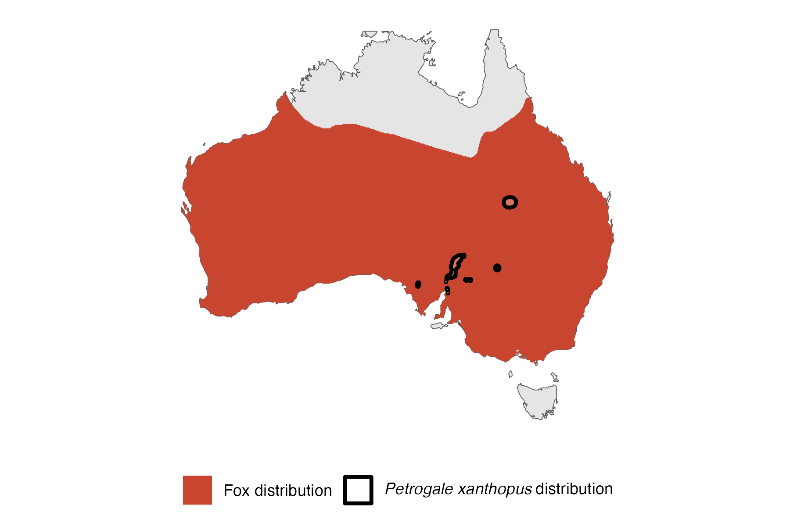
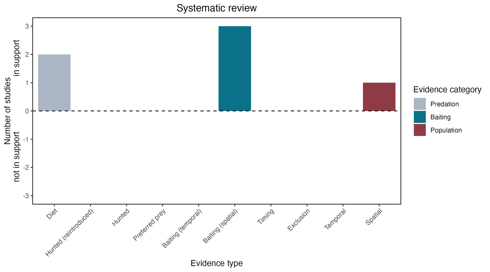

```{css, echo=FALSE}
h1, h2, h3 {
  text-align: center;
}
```

## **Yellow-footed rock-wallaby**
### *Petrogale xanthopus*

:::: {style="display: flex;"}

::: {}
  ```{r icon, echo=FALSE, fig.cap="", out.width = '100%'}
  knitr::include_graphics("assets/phylopics/PLACEHOLDER_ready.png")
  ```
:::

::: {}

:::

::: {}
  ```{r map, echo=FALSE, fig.cap="", out.width = '100%'}
  
  ```
:::

::::
<center>
IUCN Status: **Near Threatened**

EPBC Threat Rating: **Extreme**

IUCN Claim: *Predation from introduced foxes is the greatest threat to Yellow-footed Rock Wallabies (Lapidge and Henshall 2001).'*

</center>

### Studies in support

Stobo-Wilson et al. (2020b) reported that rock-wallabies were detected at 2 intensively poison-baited sites where foxes were not detected, and the wallabies were not detected at 2 control sites where foxes were detected, but no statistical analysis was provided. Lethbridge & Alexander (2008) reported that in South Australia, growth rates of rock-wallaby colonies increased where poison-baiting was intensified, and remained stable at control sites. Sharp et al. (2014) reported that at two sites in NSW and SA, intensification of poison-baiting for 3 years was associated with increased rock-wallaby abundance, while wallaby population remained stable at control sites, and that juveniles were more common at one high-intensity poisoning site. Rock-wallaby has been found in foxes’ diet (Hornsby 1997; Lapidge & Henshall 2001). Copley (1983) described that in the Gawler Ranges, rock wallabies declined after the arrival and population growth of foxes but no data was provided.

### Studies not in support

Copley (1983) described that in the Flinders Ranges, rock wallabies declined before the arrival of the fox but no data was provided.

### Is the threat claim evidence-based?

There are no studies evidencing a negative association between foxes and yellow-footed that randomised treatment and control sites, and accounted for confounding variables.
<br>
<br>



### References

Stobo-Wilson Alyson M., Brandle Robert, Johnson Christopher N., Jones Menna E. (2020) Management of invasive mesopredators in the Flinders Ranges, South Australia: effectiveness and implications. Wildlife Research 47, 720-730.

Sharp, A., Norton, M., Havelberg, C., Cliff, W., & Marks, A. (2014). Population recovery of the yellow-footed rock-wallaby following fox control in New South Wales and South Australia. Wildlife Research, 41(7), 560. doi:10.1071/wr14151

Hornsby, P. "Possible causes of mortality in the yellow-footed rock-wallaby, Petrogale xanthopus Gray (Marsupialia: Macropodidae)." Australian Mammalogy 19.2 (1997): 245-248.

Lapidge, Steven J., and Shane Henshall. "Diet Of Foxes And Cats, With Evidence Of Predation On Yellow-Footed Rock-Wallabies (Petrogale Xanthopus Celeris) By Foxes In Southwsetern Queensland." Australian Mammalogy 23.1 (2001): 47-52.

Lethbridge, Mark R., and Peter J. Alexander. "Comparing population growth rates using weighted bootstrapping: guiding the conservation management of Petrogale xanthopus xanthopus (yellow-footed rock-wallaby)." Biological Conservation 141.5 (2008): 1185-1195

Wallach et al. 2023 In Submission

