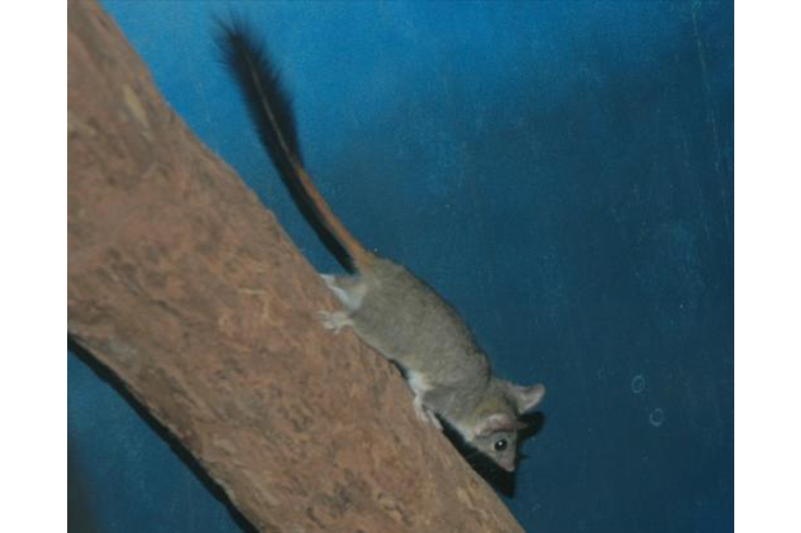
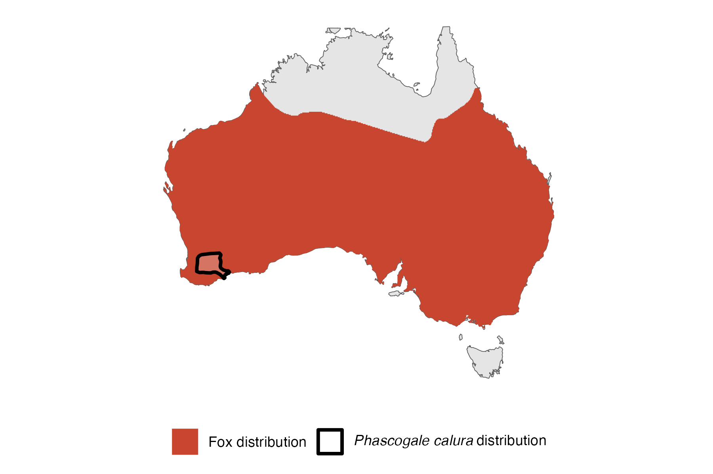

```{css, echo=FALSE}
h1, h2, h3 {
  text-align: center;
}
```

## **Red-tailed phascogale**
### *Phascogale calura*
### Blamed on foxes

:::: {style="display: flex;"}

[](https://www.inaturalist.org/photos/354983?size=original)

::: {}

:::

::: {}
  ```{r map, echo=FALSE, fig.cap="", out.width = '100%'}
  
  ```
:::

::::
<center>
IUCN status: **Near Threatened**

EPBC Predator Threat Rating: **Not assessed**

IUCN claim: *"Predation by feral cats is considered to be a severe threat over the species' entire range, but has not been quantified. Predation by the Red Fox is considered a minor threat because of the arboreal behaviour of phascogales."*

</center>

### Studies in support

Friend et al. (1996) reported a positive correlation between poison-baiting and phascogale abundance. Phascogales were last confirmed in the in the Canning Stock Route 0-6 years after foxes arrived (Current submission).

### Studies not in support

Phascogales were last confirmed in the Western Division of NSW 53-28 years before foxes arrived (Current submission).

### Is the threat claim evidence-based?

There are no studies evidencing a negative association between foxes and red-tailed phascogale populations. Poison-baiting is not a reliable proxy for fox abundance. In one region the extirpation record pre-dates the fox arrival record.
<br>
<br>

![**Evidence linking *Phascogale calura* to foxes.** **A.** Systematic review of evidence for an association between *Phascogale calura* and foxes. Positive studies are in support of the hypothesis that foxes contribute to the decline of *Phascogale calura*, negative studies are not in support. Predation studies include studies documenting hunting or scavenging; baiting studies are associations between poison baiting and threatened mammal abundance where information on predator abundance is not provided; population studies are associations between threatened mammal and predator abundance. **B.** Last records of extirpated populations relative to earliest local records of foxes. Error bars show minimum and maximum extinction intervals. Predator arrival records were digitized from Fairfax 2019. See methods section in [current submission] for details on evidence categories.](assets/figures/Main_Evidence_Fox_Phascogale calura.png)

### References


Current submission (2023) Scant evidence that introduced predators cause extinctions.

Fairfax, Dispersal of the introduced red fox (Vulpes vulpes) across Australia. Biol. Invasions 21, 1259-1268 (2019).

Friend, J. and Scanlon, M., 1996. Assessment of the Effect of Fox Control on Populations of the Red-tailed Phascogale. Phase 4: Final Report: ANCA Feral Pests Program Project 18. Department of Conservation & Land Management.

IUCN Red List. https://www.iucnredlist.org/ Accessed June 2023

