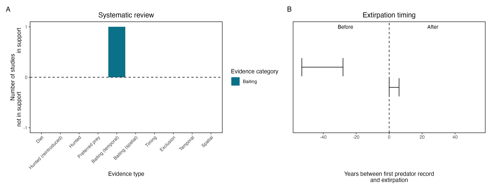

```{css, echo=FALSE}
h1, h2, h3 {
  text-align: center;
}
```

## **Red-tailed phascogale**
### *Phascogale calura*
### Blamed on foxes

:::: {style="display: flex;"}

::: {}
  ```{r icon, echo=FALSE, fig.cap="", out.width = '100%'}
  knitr::include_graphics("assets/phylopics/PLACEHOLDER_ready.png")
  ```
:::

::: {}

:::

::: {}
  ```{r map, echo=FALSE, fig.cap="", out.width = '100%'}
  knitr::include_graphics("assets/figures/Map_Fox_Phascogale calura.png")
  ```
:::

::::
<center>
IUCN Status: **Near Threatened**

EPBC Threat Rating: **N/A**

IUCN Claim: *'Predation by feral cats is considered to be a severe threat over the species' entire range, but has not been quantified. Predation by the Red Fox is considered a minor threat because of the arboreal behaviour of phascogales.''*

</center>

### Studies in support

Friend et al. (1996) reported a positive correlation between poison-baiting and phascogale abundance.

### Studies not in support

Phascogales were last confirmed in NSW 46 years before foxes arrived (Wallach et al. 202X).

### Is the threat claim evidence-based?

There are no studies evidencing a negative association between foxes and red-tailed phascogale populations. Poison baiting is not a reliable proxy for fox abundance. In contradiction with the claim the extipration record pre-dates the fox arrival record.
<br>
<br>



### References

Friend J, Scanlon M, Himbeck K. 1996. Assessment of the effect of fox control on populations of red-tailed phascogale: Phase 4: Final Report: ANCA Feral Pests Project 18, Department of Conservation & Land Management, Western Australia. Phase.

Wallach et al. 2023 In Submission

