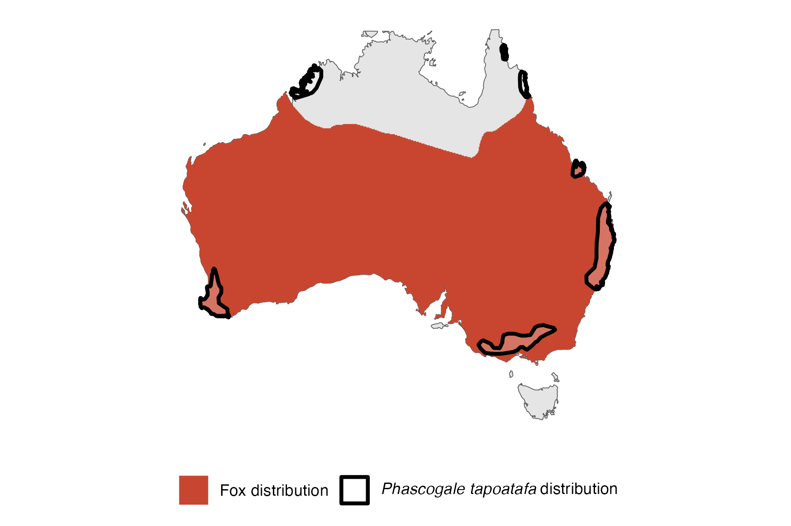

```{css, echo=FALSE}
h1, h2, h3 {
  text-align: center;
}
```

## **Brush-tailed phascogale**
### *Phascogale tapoatafa*
### Blamed on foxes

:::: {style="display: flex;"}

::: {}
  ```{r icon, echo=FALSE, fig.cap="", out.width = '100%'}
  knitr::include_graphics("assets/phylopics/PLACEHOLDER_ready.png")
  ```
:::

::: {}

:::

::: {}
  ```{r map, echo=FALSE, fig.cap="", out.width = '100%'}
  
  ```
:::

::::
<center>
IUCN Status: **Near Threatened**

EPBC Threat Rating: **N/A**

IUCN Claim: *'Predation by the red fox is also a threat''*

</center>

### Studies in support

Phascogale remains were found in <1% of fox scats (Pascoe et al. 2012).

### Studies not in support

Phascogale persisted at low abundance as fox abundance increased, but no statistical analysis, control, or other variables were tested for (Wayne et al. 2017).

### Is the threat claim evidence-based?

There are no studies linking foxes to brush-tailed phascogale populations.
<br>
<br>

![**Fig. 1**  Systematic review of evidence for an association between *Phascogale tapoatafa* and foxes. Positive studies are in support of the hypothesis that foxes contribute to the decline of threatened mammals, negative studies are not in support. Predation studies include studies documenting hunting or scavenging; baiting studies are associations between poison baiting and threatened mammal abundance where information on predator abundance is not provided; population studies are associations between threatened mammal and predator abundance.](assets/figures/Main_Evidence_Fox_Phascogale tapoatafa.png)

### References

Wayne, Adrian F., et al. "Recoveries and cascading declines of native mammals associated with control of an introduced predator." Journal of Mammalogy 98.2 (2017): 489-50

Pascoe, Jack H., et al. "Diet analysis of mammals, raptors and reptiles in a complex predator assemblage in the Blue Mountains, eastern Australia." Australian Journal of Zoology 59.5 (2012): 295-301.

Wallach et al. 2023 In Submission

