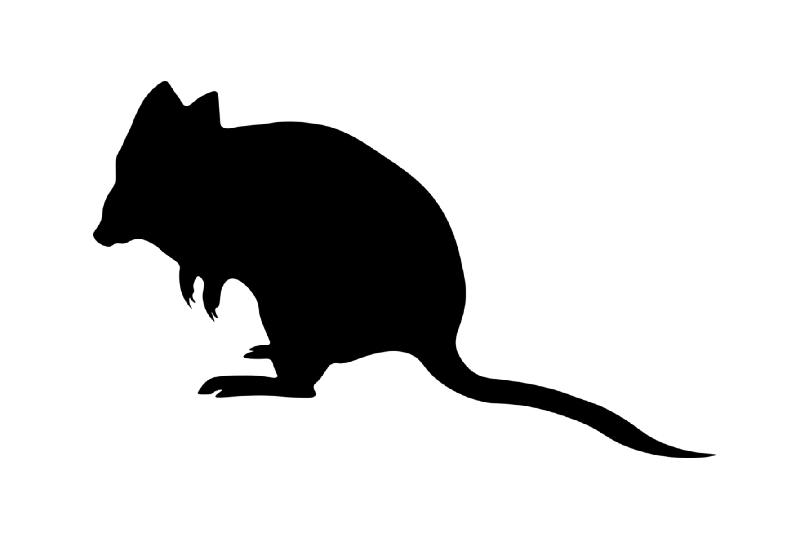
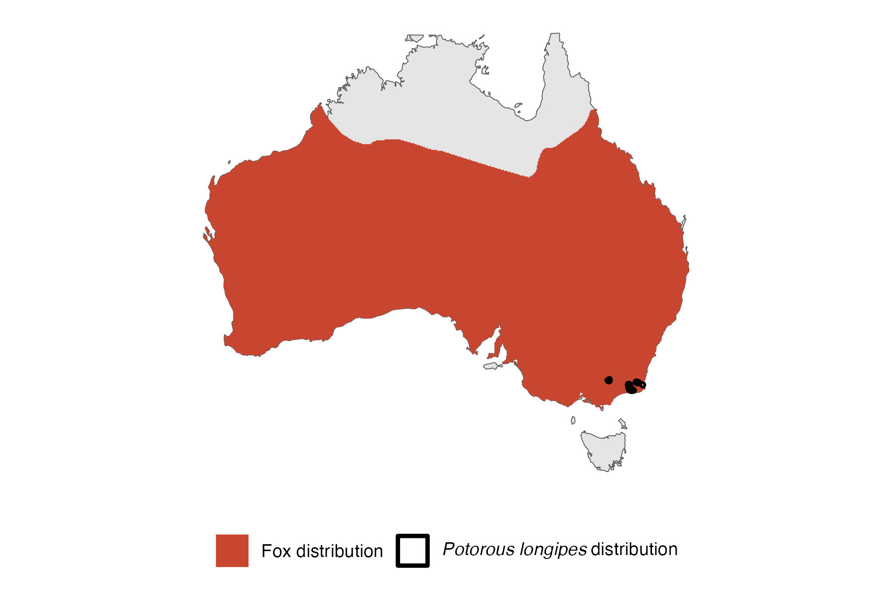

```{css, echo=FALSE}
h1, h2, h3 {
  text-align: center;
}
```

## **Long-footed potoroo**
### *Potorous longipes*
### Blamed on foxes

:::: {style="display: flex;"}

[](https://www.inaturalist.org/photos/40315288?size=original)

::: {}

:::

::: {}
  ```{r map, echo=FALSE, fig.cap="", out.width = '100%'}
  
  ```
:::

::::
<center>
IUCN status: **Vulnerable**

EPBC Threat Rating: **Very high**

IUCN claim: *"Major threats to the species include predation from foxes"*

</center>

### Studies in support

Long-footed potoroos were reported at lower occupancy when fox density was above zero (Robley et al. 2022). Potoroos were also found in foxes’ diet (Davis et al. 2015).

### Studies not in support

No studies

### Is the threat claim evidence-based?

Foxes were found to be correlated negatively with long-footed potoroos in a single unpublished study which did not test for confounding variables.
<br>
<br>

![**Evidence linking *Potorous longipes* to foxes.** Systematic review of evidence for an association between *Potorous longipes* and foxes. Positive studies are in support of the hypothesis that *foxes* contribute to the decline of Potorous longipes, negative studies are not in support. Predation studies include studies documenting hunting or scavenging; baiting studies are associations between poison baiting and threatened mammal abundance where information on predator abundance is not provided; population studies are associations between threatened mammal and predator abundance.](assets/figures/Main_Evidence_Fox_Potorous longipes.png)

### References

Current submission (2023) Scant evidence that introduced predators cause extinctions. Conservation Biology

Davis, N.E., Forsyth, D.M., Triggs, B., Pascoe, C., Benshemesh, J., Robley, A., Lawrence, J., Ritchie, E.G., Nimmo, D.G. and Lumsden, L.F., 2015. Interspecific and geographic variation in the diets of sympatric carnivores: dingoes/wild dogs and red foxes in south-eastern Australia. PloS One, 10(3), p.e0120975.

EPBC. (2015) Threat Abatement Plan for Predation by Feral Cats. Environment Protection and Biodiversity Conservation Act 1999, Department of Environment, Government of Australia. (Table A1).

Robley, A.J., Cally, J.G., Murray, A., Bluff, L., Collyer, A., Borg, N. and Phillips, L., 2022. The response of native species to the 2019–20 bushfires and introduced predators in far East Gippsland. Arthur Rylah Institute for Environmental Research Technical Report Series No. 329. Department of Environment. Land, Water and Planning, Heidelberg.

