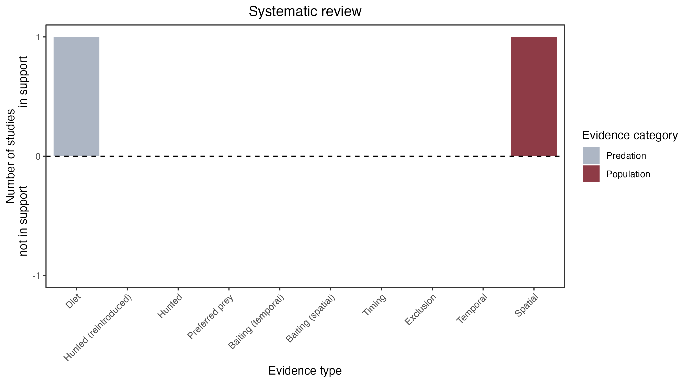

```{css, echo=FALSE}
h1, h2, h3 {
  text-align: center;
}
```

## **Long-footed potoroo**
### *Potorous longipes*
### Blamed on foxes

:::: {style="display: flex;"}

::: {}
  ```{r icon, echo=FALSE, fig.cap="", out.width = '100%'}
  knitr::include_graphics("assets/phylopics/PLACEHOLDER_ready.png")
  ```
:::

::: {}

:::

::: {}
  ```{r map, echo=FALSE, fig.cap="", out.width = '100%'}
  
  ```
:::

::::
<center>
IUCN Status: **Vulnerable**

EPBC Threat Rating: **Very high**

IUCN Claim: *'Major threats to the species include predation from foxes''*

</center>

### Studies in support

Found in foxes’ diet (Davis et al. 2015).

### Studies not in support

No studies

### Is the threat claim evidence-based?

There are no studies linking foxes to long-footed potoroo populations.
<br>
<br>



### References

Davis, Naomi E., et al. "Interspecific and geographic variation in the diets of sympatric carnivores: dingoes/wild dogs and red foxes in south-eastern Australia." PloS one 10.3 (2015): e0120975

Wallach et al. 2023 In Submission

