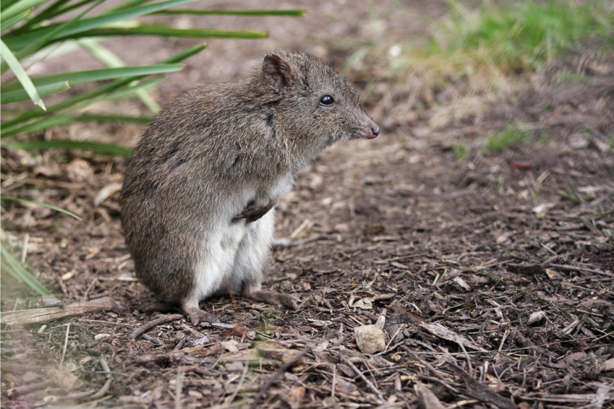
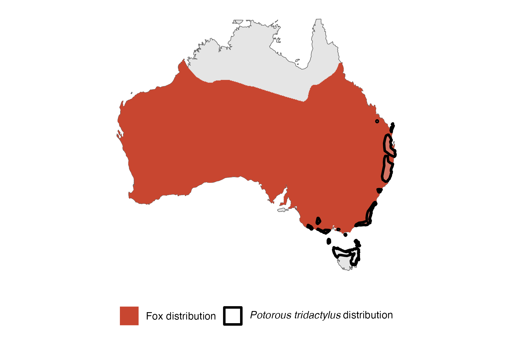

```{css, echo=FALSE}
h1, h2, h3 {
  text-align: center;
}
```

## **Long-nosed potoroo**
### *Potorous tridactylus*
### Blamed on foxes

:::: {style="display: flex;"}

[](https://www.inaturalist.org/photos/68883?size=original)

::: {}

:::

::: {}
  ```{r map, echo=FALSE, fig.cap="", out.width = '100%'}
  
  ```
:::

::::
<center>
IUCN status: **Near Threatened**

EPBC Threat Rating: **Very high**

IUCN claim: *"The major threat is predation, especially by the invasive Red Fox but also by wild dogs and feral cats. "*

</center>

### Studies in support

Foxes hunt potoroos (Lunney et al. 1990; Long 2001; Glen & Dickman 2008; Claridge et al. 2010; Glen et al. 2011; Davis et al. 2015; Norton et al. 2015). Dexter & Murray (2009) reported that potoroo abundance increased about two years after intensification of poison-baiting in both treatment and control sites, but more steeply in the high intensity poisoning sites, but there was no difference in bait uptake between the treatment and control sites. Robley et al. (2014) reported that three measures of potoroo abundance tended to be higher at sites where poison-baiting was intensified compared to controls, corresponding with differences in bait uptake.

### Studies not in support

No association between fox and potoroo abundance was found between two adjacent sites (Norton et al. 2015). Long-nosed potoroo and fox occupancy were not correlated (Robley et al. 2022).

### Is the threat claim evidence-based?

There are no studies evidencing a negative association between foxes and long-nosed potoroo populations. Poison-baiting is not a reliable proxy for fox abundance.
<br>
<br>

![**Evidence linking *Potorous tridactylus* to foxes.** Systematic review of evidence for an association between *Potorous tridactylus* and foxes. Positive studies are in support of the hypothesis that *foxes* contribute to the decline of Potorous tridactylus, negative studies are not in support. Predation studies include studies documenting hunting or scavenging; baiting studies are associations between poison baiting and threatened mammal abundance where information on predator abundance is not provided; population studies are associations between threatened mammal and predator abundance.](assets/figures/Main_Evidence_Fox_Potorous tridactylus.png)

### References

Claridge, A.W., Mills, D.J. and Barry, S.C., 2010. Prevalence of threatened native species in canid scats from coastal and near-coastal landscapes in south-eastern Australia. Australian Mammalogy, 32(2), pp.117-126.

Current submission (2023) Scant evidence that introduced predators cause extinctions. Conservation Biology

Davis, N.E., Forsyth, D.M., Triggs, B., Pascoe, C., Benshemesh, J., Robley, A., Lawrence, J., Ritchie, E.G., Nimmo, D.G. and Lumsden, L.F., 2015. Interspecific and geographic variation in the diets of sympatric carnivores: dingoes/wild dogs and red foxes in south-eastern Australia. PloS One, 10(3), p.e0120975.

Dexter, N. and Murray, A., 2009. The impact of fox control on the relative abundance of forest mammals in East Gippsland, Victoria. Wildlife Research, 36(3), pp.252-261.

EPBC. (2015) Threat Abatement Plan for Predation by Feral Cats. Environment Protection and Biodiversity Conservation Act 1999, Department of Environment, Government of Australia. (Table A1).

Glen, A.S. and Dickman, C.R., 2008. Niche overlap between marsupial and eutherian carnivores: does competition threaten the endangered spotted‐tailed quoll?. Journal of Applied Ecology, 45(2), pp.700-707.

Glen, A.S., Pennay, M., Dickman, C.R., Wintle, B.A. and Firestone, K.B., 2011. Diets of sympatric native and introduced carnivores in the Barrington Tops, eastern Australia. Austral Ecology, 36(3), pp.290-296.

Long, K.I., 2001. Spatio-temporal interactions among male and female Long-nosed Potoroos, Potorous tridactylus (Marsupialia: Macropodoidea): mating system implications. Australian Journal of Zoology, 49(1), pp.17-26.

Lunney, D., Triggs, B., Eby, P. and Ashby, E., 1990. Analysis of scats of dogs Canis-familiaris and foxes Vulpes-Vulpes (Canidae, Carnivora) in coastal forests near Bega, New-South-Wales. Wildlife Research, 17(1), pp.61-68.

Norton, M.A., Prentice, A., Dingle, J., French, K. and Claridge, A.W., 2015. Population characteristics and management of the long-nosed potoroo (Potorous tridactylus) in high-quality habitat in the Southern Highlands of New South Wales. Australian Mammalogy, 37(1), pp.67-74.

Robley, A., Gormley, A.M., Forsyth, D.M. and Triggs, B., 2014. Long-term and large-scale control of the introduced red fox increases native mammal occupancy in Australian forests. Biological Conservation, 180, pp.262-269.

Robley, A.J., Cally, J.G., Murray, A., Bluff, L., Collyer, A., Borg, N. and Phillips, L., 2022. The response of native species to the 2019–20 bushfires and introduced predators in far East Gippsland. Arthur Rylah Institute for Environmental Research Technical Report Series No. 329. Department of Environment. Land, Water and Planning, Heidelberg.

