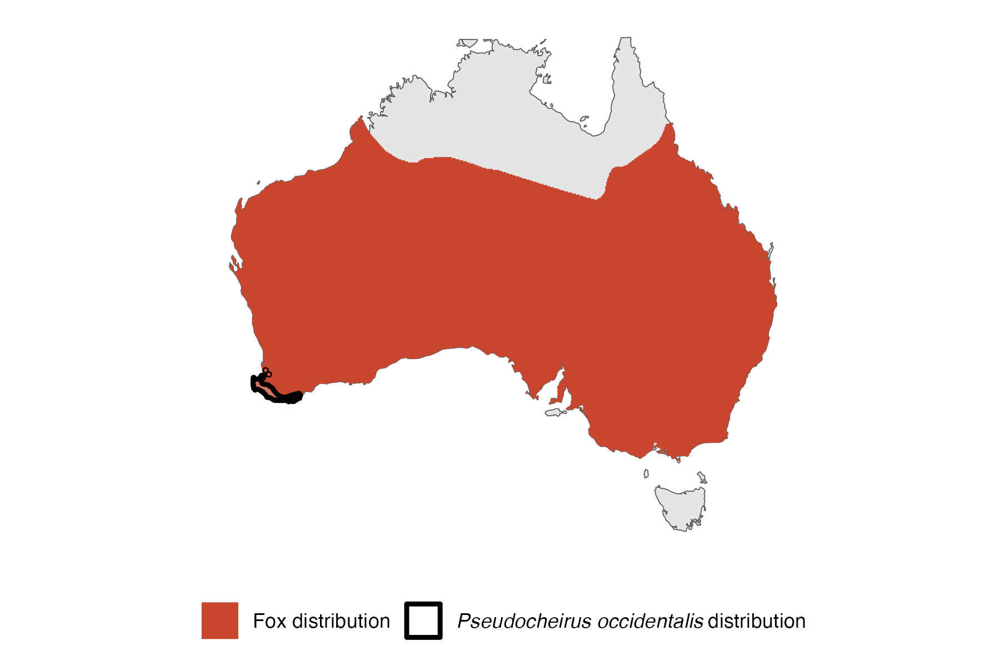

```{css, echo=FALSE}
h1, h2, h3 {
  text-align: center;
}
```

## **Western ringtail possum**
### *Pseudocheirus occidentalis*
### Blamed on foxes

:::: {style="display: flex;"}

::: {}
  ```{r icon, echo=FALSE, fig.cap="", out.width = '100%'}
  knitr::include_graphics("assets/phylopics/PLACEHOLDER_ready.png")
  ```
:::

::: {}

:::

::: {}
  ```{r map, echo=FALSE, fig.cap="", out.width = '100%'}
  
  ```
:::

::::
<center>
IUCN Status: **Critically Endangered**

EPBC Threat Rating: **Very high/Extreme**

IUCN Claim: *'Translocation experiments in the past and other data demonstrate that Red Foxes and feral Cats are major threats''*

</center>

### Studies in support

Foxes hunt locally-born possums (Jones et al. 1994; Grimm & De Tores 2009) and they hunted 9 of 68 reintroduced possums (Clarke 2011).

### Studies not in support

Decades of poison-baiting aimed at foxes did not prevent population decline (Wayne et al. 2017).

### Is the threat claim evidence-based?

There are no studies linking foxes to Western ringtail possum populations.
<br>
<br>

![**Fig. 1**  Systematic review of evidence for an association between *Pseudocheirus occidentalis* and foxes. Positive studies are in support of the hypothesis that foxes contribute to the decline of threatened mammals, negative studies are not in support. Predation studies include studies documenting hunting or scavenging; baiting studies are associations between poison baiting and threatened mammal abundance where information on predator abundance is not provided; population studies are associations between threatened mammal and predator abundance.](assets/figures/Main_Evidence_Fox_Pseudocheirus occidentalis.png)

### References

Jones, B. A., R. A. How, and D. J. Kitchener. "A field study of Pseudocheirus occidentalis (Marsupialia: Petauridae) II. Population studies." Wildlife Research 21.2 (1994): 189-201.

Grimm, H.L and de Tores P.J. (2009). Some aspects of the biology of the common brushtail possum (Trichosurus vulpecula) and the threatened western ringtail possum (Pseudocheirus occidentalis) in a pine plantation scheduled for harvesting and in adjacent tuart and peppermint woodland near Busselton, Western Australia. Report prepared for the Forest Products Commission, Government of Western Australia.

Wayne, Adrian F., et al. "Recoveries and cascading declines of native mammals associated with control of an introduced predator." Journal of Mammalogy 98.2 (2017): 489-50

Clarke, J. R. (2011). Translocation outcomes for the western ringtail possum (Pseudocheirus occidentalis) in the presence of the common brushtail possum (Trichosurus vulpecula): health, survivorship and habitat use. (Doctoral dissertation) Murdoch University, Western Australia.

Wallach et al. 2023 In Submission

