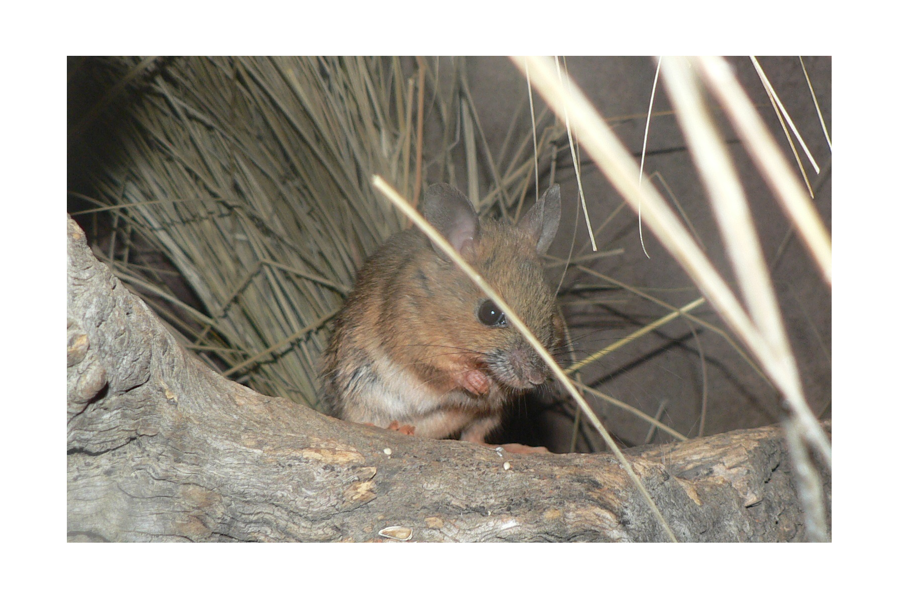
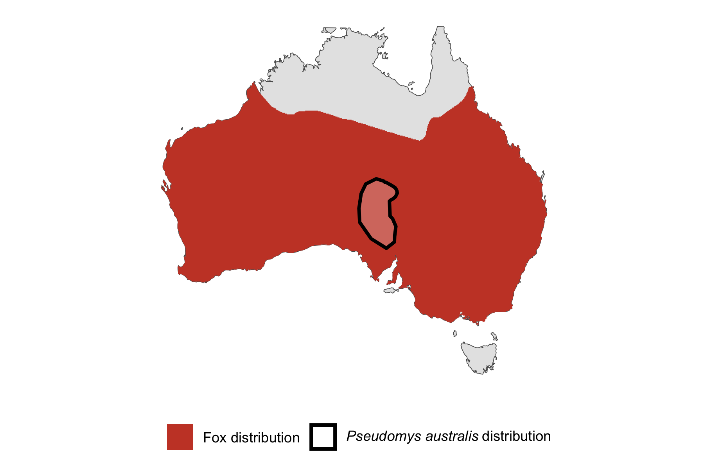

```{css, echo=FALSE}
h1, h2, h3 {
  text-align: center;
}
```

## **Plains rat**
### *Pseudomys australis*
### Blamed on foxes

:::: {style="display: flex;"}

[](https://www.inaturalist.org/photos/470313?size=original)

::: {}

:::

::: {}
  ```{r map, echo=FALSE, fig.cap="", out.width = '100%'}
  
  ```
:::

::::
<center>
IUCN status: **Vulnerable**

EPBC Threat Rating: **Very high**

IUCN claim: *" Recent research has demonstrated marked detrimental impact of introduced predators: red fox (vulpes vulpes) and feral domestic cats (felis catus)"*

</center>

### Studies in support

Plains rats remains were found in the foxes' diet (Pavey et al. 2008; Pavey et al. 2014). Read & Cunningham (2010) described an occasion where more plains rats were captured inside than outside a fenced reserve where carnivores were excluded. Rats were last confirmed at Koonchera Dune, SA, 24 years after foxes arrived (Wallach et al. 202X).

### Studies not in support

Rats were last confirmed in NSW 63 years before foxes arrived (Wallach et al. 202X).

### Is the threat claim evidence-based?

There are no studies evidencing a negative association between foxes and plains rats which report data. In contradiction with the claim, NSW extirpation record pre-dates fox arrival record.
<br>
<br>

![**Evidence linking *Pseudomys australis* to foxes.** **A.** Systematic review of evidence for an association between *Pseudomys australis* and foxes. Positive studies are in support of the hypothesis that foxes contribute to the decline of *Pseudomys australis*, negative studies are not in support. Predation studies include studies documenting hunting or scavenging; baiting studies are associations between poison baiting and threatened mammal abundance where information on predator abundance is not provided; population studies are associations between threatened mammal and predator abundance. **B.** Last records of extirpated populations relative to earliest local records of foxes. Error bars show record uncertainty range. Predator arrival records were digitized from Fairfax 2019. Small points show unconfirmed records (excluded from analyses).](assets/figures/Main_Evidence_Fox_Pseudomys australis.png)

### References

Chris R. Pavey, Stephen R. Eldridge, Mike Heywood, Population Dynamics and Prey Selection of Native and Introduced Predators During a Rodent Outbreak in Arid Australia, Journal of Mammalogy, Volume 89, Issue 3, 5 June 2008, Pages 674–683, https://doi.org/10.1644/07-MAMM-A-168R.1

EPBC. (2015) Threat Abatement Plan for Predation by Feral Cats. Environment Protection and Biodiversity Conservation Act 1999, Department of Environment, Government of Australia. (Table A1).

Fairfax, Dispersal of the introduced red fox (Vulpes vulpes) across Australia. Biol. Invasions 21, 1259-1268 (2019).

Pavey CR, Cole JR, McDonald PJ, Nano CEM (2014) Population dynamics and spatial ecology of a declining desert rodent Pseudomys australis: the importance of refuges for persistence. J Mammal 95: 615–625

Read, John L., and Ross Cunningham. "Relative impacts of cattle grazing and feral animals on an Australian arid zone reptile and small mammal assemblage." Austral Ecology 35.3 (2010): 314-324

Wallach et al. 2023 In Submission

