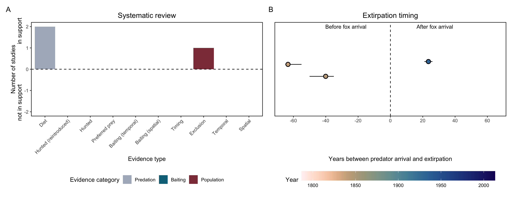

```{css, echo=FALSE}
h1, h2, h3 {
  text-align: center;
}
```

## **Plains rat**
### *Pseudomys australis*
### Blamed on foxes

:::: {style="display: flex;"}

::: {}
  ```{r icon, echo=FALSE, fig.cap="", out.width = '100%'}
  knitr::include_graphics("assets/phylopics/PLACEHOLDER_ready.png")
  ```
:::

::: {}

:::

::: {}
  ```{r map, echo=FALSE, fig.cap="", out.width = '100%'}
  knitr::include_graphics("assets/figures/Map_Fox_Pseudomys australis.png")
  ```
:::

::::
<center>
IUCN Status: **Vulnerable**

EPBC Threat Rating: **Very high**

IUCN Claim: *' Recent research has demonstrated marked detrimental impact of introduced predators: Red Fox (Vulpes vulpes) and feral Domestic Cats (Felis catus)''*

</center>

### Studies in support

Plains rats remains were found in the foxes' diet (Pavey et al. 2008; Pavey et al. 2014). Read & Cunningham (2010) described an occasion where more plains rats were captured inside than outside a fenced reserve where carnivores were excluded. Rats were last confirmed at Koonchera Dune, SA, 24 years after foxes arrived (Wallach et al. 202X).

### Studies not in support

Rats were last confirmed in NSW 63 years before foxes arrived (Wallach et al. 202X).

### Is the threat claim evidence-based?

There are no studies evidencing a negative association between foxes and plains rats which report data. In contradiction with the claim, NSW extirpation record pre-dates fox arrival record.
<br>
<br>



### References

Pavey CR, Cole JR, McDonald PJ, Nano CEM (2014) Population dynamics and spatial ecology of a declining desert rodent Pseudomys australis: the importance of refuges for persistence. J Mammal 95: 615–625

Chris R. Pavey, Stephen R. Eldridge, Mike Heywood, Population Dynamics and Prey Selection of Native and Introduced Predators During a Rodent Outbreak in Arid Australia, Journal of Mammalogy, Volume 89, Issue 3, 5 June 2008, Pages 674–683, https://doi.org/10.1644/07-MAMM-A-168R.1

Read, John L., and Ross Cunningham. "Relative impacts of cattle grazing and feral animals on an Australian arid zone reptile and small mammal assemblage." Austral Ecology 35.3 (2010): 314-324

Wallach et al. 2023 In Submission

