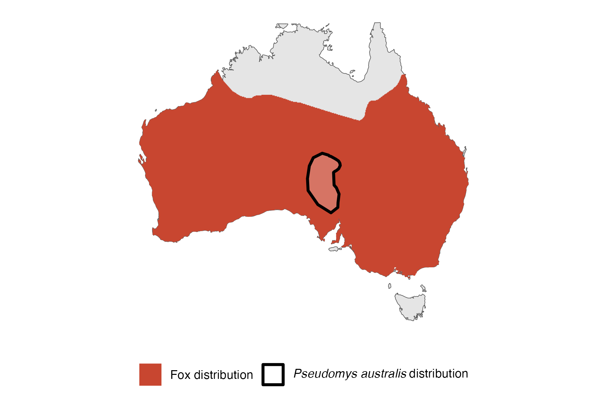

```{css, echo=FALSE}
h1, h2, h3 {
  text-align: center;
}
```

## **Plains rat**
### *Pseudomys australis*
### Blamed on foxes

:::: {style="display: flex;"}

[](https://www.inaturalist.org/photos/470313?size=original)

::: {}

:::

::: {}
  ```{r map, echo=FALSE, fig.cap="", out.width = '100%'}
  
  ```
:::

::::
<center>
IUCN status: **Vulnerable**

EPBC Predator Threat Rating: **Very high**

IUCN claim: *"Recent research has demonstrated marked detrimental impact of introduced predators: Red Fox (Vulpes vulpes) and feral Domestic Cats (Felis catus)"*

</center>

### Studies in support

Plains rats were more common inside a predator-proof fenced area compared to outside (Moseby et al. 2020), as was also observed by Read & Cunningham (2010). Plains rats remains were found in the foxes' diet (Pavey et al. 2008; Pavey et al. 2014). Rats were last confirmed in Koonchera Dune, SA, 21-26 years after foxes arrived (Current submission).

### Studies not in support

Rats were last confirmed in Mootwingee National Park, NSW, 70-40 years before foxes arrived (Current submission).

### Is the threat claim evidence-based?

Absence of predators was associated with higher plains rat abundance is supportive of the hypothesis but data comes from a single study site, and thus possibly confounded. In one region the extirpation record pre-dates the fox arrival record.
<br>
<br>

![**Evidence linking *Pseudomys australis* to foxes.** **A.** Systematic review of evidence for an association between *Pseudomys australis* and foxes. Positive studies are in support of the hypothesis that foxes contribute to the decline of *Pseudomys australis*, negative studies are not in support. Predation studies include studies documenting hunting or scavenging; baiting studies are associations between poison baiting and threatened mammal abundance where information on predator abundance is not provided; population studies are associations between threatened mammal and predator abundance. **B.** Last records of extirpated populations relative to earliest local records of foxes. Error bars show minimum and maximum extinction intervals. Predator arrival records were digitized from Fairfax 2019. Small points show unconfirmed records (excluded from analyses). See methods section in [current submission] for details on evidence categories.](assets/figures/Main_Evidence_Fox_Pseudomys australis.png)

### References

Current submission (2023) Scant evidence that introduced predators cause extinctions.

EPBC. (2015) Threat Abatement Plan for Predation by Feral Cats. Environment Protection and Biodiversity Conservation Act 1999, Department of Environment, Government of Australia. (Table A1).

Fairfax, Dispersal of the introduced red fox (Vulpes vulpes) across Australia. Biol. Invasions 21, 1259-1268 (2019).

IUCN Red List. https://www.iucnredlist.org/ Accessed June 2023

Pavey, C.R., Cole, J.R., McDonald, P.J. and Nano, C.E., 2014. Population dynamics and spatial ecology of a declining desert rodent, Pseudomys australis: the importance of refuges for persistence. Journal of Mammalogy, 95(3), pp.615-625.

Pavey, C.R., Eldridge, S.R. and Heywood, M., 2008. Population dynamics and prey selection of native and introduced predators during a rodent outbreak in arid Australia. Journal of Mammalogy, 89(3), pp.674-683.

Read, J.L. and Cunningham, R., 2010. Relative impacts of cattle grazing and feral animals on an Australian arid zone reptile and small mammal assemblage. Austral Ecology, 35(3), pp.314-324.

