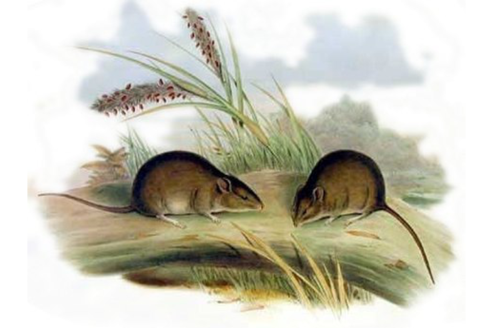
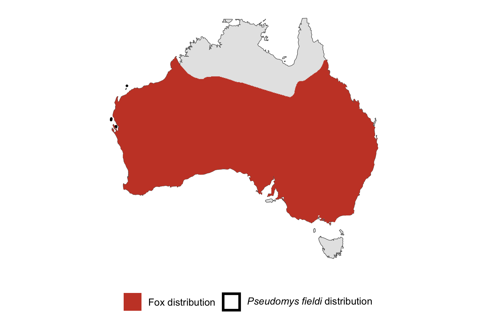

```{css, echo=FALSE}
h1, h2, h3 {
  text-align: center;
}
```

## **Gould's mouse**
### *Pseudomys fieldi*
### Blamed on foxes

:::: {style="display: flex;"}

[](https://www.inaturalist.org/photos/136753?size=original)

::: {}

:::

::: {}
  ```{r map, echo=FALSE, fig.cap="", out.width = '100%'}
  
  ```
:::

::::
<center>
IUCN Status: **Vulnerable**

EPBC Threat Rating: **Moderate**

IUCN Claim: *"Predation by feral Domestic Cats (Felis catus), Red Foxes (Vulpes vulpes) and Black Rats (Rattus rattus) could have severe to catastrophic effects if they establish on island. Feral Cats and Red Foxes have caused the extinction of medium-sized mammals on arid Australian islands'"*

</center>

### Studies in support

No studies

### Studies not in support

Mouse was last confirmed in NSW, NT, and south-west WA 22-86 years before foxes arrived (Wallach et al. 202X).

### Is the threat claim evidence-based?

There are no studies linking foxes to Gould's mice. In contradiction with the claim, extirpation records pre-date fox arrival records.
<br>
<br>

![**Evidence linking *Pseudomys fieldi* to foxes.** Systematic review of evidence for an association between *Pseudomys fieldi* and foxes. Positive studies are in support of the hypothesis that *foxes* contribute to the decline of Pseudomys fieldi, negative studies are not in support. Predation studies include studies documenting hunting or scavenging; baiting studies are associations between poison baiting and threatened mammal abundance where information on predator abundance is not provided; population studies are associations between threatened mammal and predator abundance.](assets/figures/Main_Evidence_Fox_Pseudomys fieldi.png)

### References


Wallach et al. 2023 In Submission

