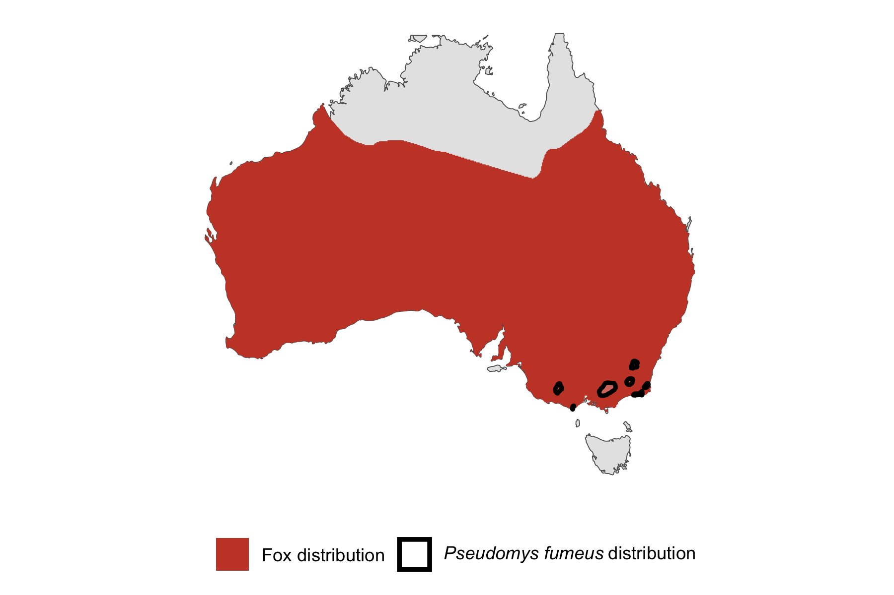

```{css, echo=FALSE}
h1, h2, h3 {
  text-align: center;
}
```

## **Smoky mouse**
### *Pseudomys fumeus*
### Blamed on foxes

:::: {style="display: flex;"}

::: {}
  ```{r icon, echo=FALSE, fig.cap="", out.width = '100%'}
  knitr::include_graphics("assets/phylopics/PLACEHOLDER_ready.png")
  ```
:::

::: {}

:::

::: {}
  ```{r map, echo=FALSE, fig.cap="", out.width = '100%'}
  
  ```
:::

::::
<center>
IUCN Status: **Vulnerable**

EPBC Threat Rating: **High**

IUCN Claim: *"The species is significantly preyed upon by introduced Red Foxes (Vulpes vulpes), wild dogs (Canis lupus dingo), and feral Domestic Cats (Felis catus). '"*

</center>

### Studies in support

Foxes hunt smoky mice (Davis et al. 2015).

### Studies not in support

No studies

### Is the threat claim evidence-based?

There are no studies linking foxes to smoky mouse populations.
<br>
<br>

![ Systematic review of evidence for an association between *Pseudomys fumeus* and foxes. Positive studies are in support of the hypothesis that *foxes* contribute to the decline of Pseudomys fumeus, negative studies are not in support. Predation studies include studies documenting hunting or scavenging; baiting studies are associations between poison baiting and threatened mammal abundance where information on predator abundance is not provided; population studies are associations between threatened mammal and predator abundance.](assets/figures/Main_Evidence_Fox_Pseudomys fumeus.png)

### References

Davis, Naomi E., et al. "Interspecific and geographic variation in the diets of sympatric carnivores: dingoes/wild dogs and red foxes in south-eastern Australia." PloS one 10.3 (2015): e0120975

Wallach et al. 2023 In Submission

