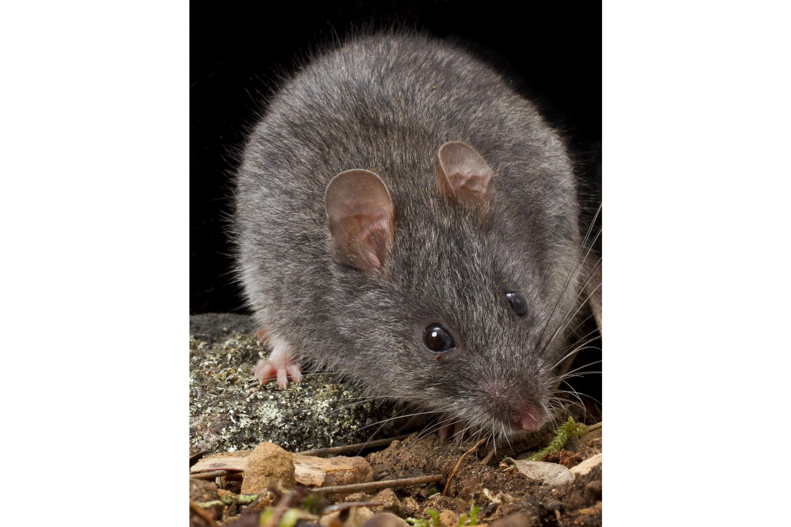

```{css, echo=FALSE}
h1, h2, h3 {
  text-align: center;
}
```

## **Smoky mouse**
### *Pseudomys fumeus*
### Blamed on foxes

:::: {style="display: flex;"}

[](https://www.inaturalist.org/photos/60090802?size=original)

::: {}

:::

::: {}
  ```{r map, echo=FALSE, fig.cap="", out.width = '100%'}
  knitr::include_graphics("assets/figures/Map_Fox_Pseudomys fumeus.png")
  ```
:::

::::
<center>
IUCN status: **Vulnerable**

EPBC Predator Threat Rating: **Major**

IUCN claim: *"The species is significantly preyed upon by introduced Red Foxes (Vulpes vulpes), wild dogs (Canis lupus dingo), and feral Domestic Cats (Felis catus). "*

</center>

### Studies in support

Foxes hunt smoky mice (Davis et al. 2015).

### Studies not in support

No studies

### Is the threat claim evidence-based?

There are no studies linking foxes to smoky mouse populations.
<br>
<br>

![**Evidence linking *Pseudomys fumeus* to foxes.** Systematic review of evidence for an association between *Pseudomys fumeus* and foxes. Positive studies are in support of the hypothesis that *foxes* contribute to the decline of Pseudomys fumeus, negative studies are not in support. Predation studies include studies documenting hunting or scavenging; baiting studies are associations between poison baiting and threatened mammal abundance where information on predator abundance is not provided; population studies are associations between threatened mammal and predator abundance. See methods section in [current submission] for details on evidence categories.](assets/figures/Main_Evidence_Fox_Pseudomys fumeus.png)

### References

Current submission (2023) Scant evidence that introduced predators cause extinctions.

Davis, N.E., Forsyth, D.M., Triggs, B., Pascoe, C., Benshemesh, J., Robley, A., Lawrence, J., Ritchie, E.G., Nimmo, D.G. and Lumsden, L.F., 2015. Interspecific and geographic variation in the diets of sympatric carnivores: dingoes/wild dogs and red foxes in south-eastern Australia. PloS One, 10(3), p.e0120975.

EPBC. (2013) Threat Abatement Plan for Predation by the European Red Fox (2008). Five yearly review. Environment Protection and Biodiversity Conservation Act 1999, Department of the Environment, Water, Heritage and the Arts, Government of Australia (Appendix E: EPBC Act listed threatened species).

IUCN Red List. https://www.iucnredlist.org/ Accessed June 2023

