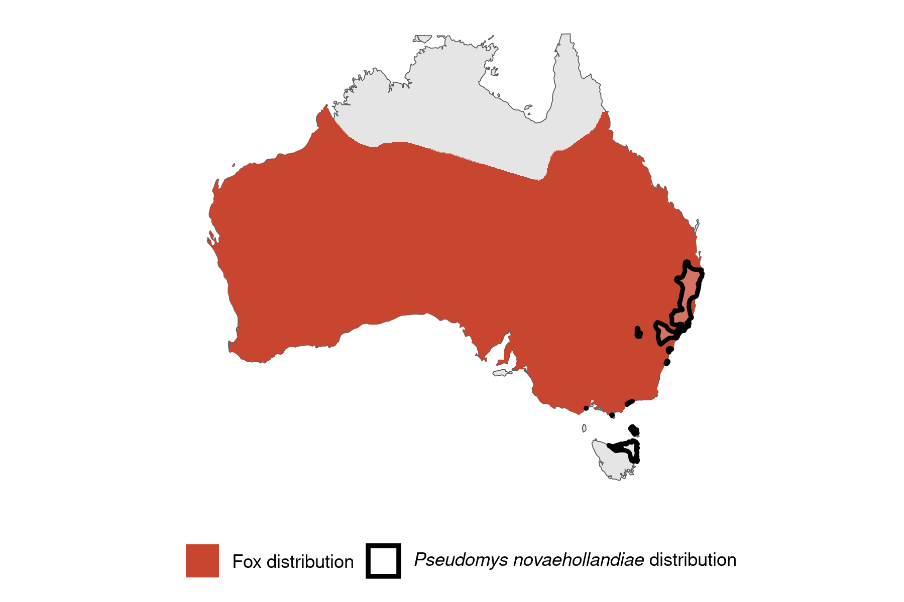

```{css, echo=FALSE}
h1, h2, h3 {
  text-align: center;
}
```

## **New Holland mouse**
### *Pseudomys novaehollandiae*
### Blamed on foxes

:::: {style="display: flex;"}

::: {}
  ```{r icon, echo=FALSE, fig.cap="", out.width = '100%'}
  knitr::include_graphics("assets/phylopics/PLACEHOLDER_ready.png")
  ```
:::

::: {}

:::

::: {}
  ```{r map, echo=FALSE, fig.cap="", out.width = '100%'}
  
  ```
:::

::::
<center>
IUCN Status: **Vulnerable**

EPBC Threat Rating: **Moderate**

IUCN Claim: *'Predation by Red Foxes (moderate to minor): there is no direct evidence of significant predation on this species by Red Fox (Vulpes vulpes). Predation of similar-sized Pseudomys elsewhere is not significant at the population level.''*

</center>

### Studies in support

Foxes hunt mice (Mitchell & Banks 2005; Pascoe et al. 2012).

### Studies not in support

No studies

### Is the threat claim evidence-based?

There are no studies linking foxes to New Holland mouse populations.
<br>
<br>

![**Fig. 1**  Systematic review of evidence for an association between *Pseudomys novaehollandiae* and foxes. Positive studies are in support of the hypothesis that foxes contribute to the decline of Pseudomys novaehollandiae, negative studies are not in support. Predation studies include studies documenting hunting or scavenging; baiting studies are associations between poison baiting and threatened mammal abundance where information on predator abundance is not provided; population studies are associations between threatened mammal and predator abundance.](assets/figures/Main_Evidence_Fox_Pseudomys novaehollandiae.png)

### References

Mitchell, Bruce D., and Peter B. Banks. "Do wild dogs exclude foxes? Evidence for competition from dietary and spatial overlaps." Austral Ecology 30.5 (2005): 581-591.

Pascoe, Jack H., et al. "Diet analysis of mammals, raptors and reptiles in a complex predator assemblage in the Blue Mountains, eastern Australia." Australian Journal of Zoology 59.5 (2012): 295-301.

Wallach et al. 2023 In Submission

