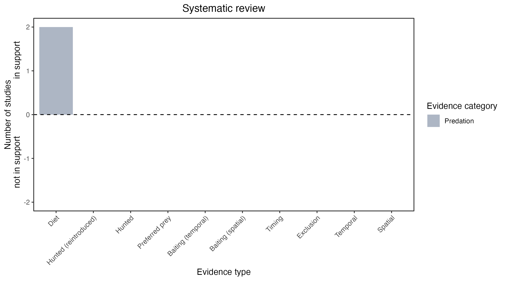

```{css, echo=FALSE}
h1, h2, h3 {
  text-align: center;
}
```

## **New Holland mouse**
### *Pseudomys novaehollandiae*

:::: {style="display: flex;"}

::: {}
  ```{r icon, echo=FALSE, fig.cap="", out.width = '100%'}
  knitr::include_graphics("assets/phylopics/PLACEHOLDER_ready.png")
  ```
:::

::: {}

:::

::: {}
  ```{r map, echo=FALSE, fig.cap="", out.width = '100%'}
  knitr::include_graphics("assets/figures/Map_Fox_Pseudomys novaehollandiae.png")
  ```
:::

::::
<center>
IUCN Status: **Vulnerable**

EPBC Threat Rating: **Moderate**

IUCN Claim: *Predation by Red Foxes (moderate to minor): there is no direct evidence of significant predation on this species by Red Fox (Vulpes vulpes). Predation of similar-sized Pseudomys elsewhere is not significant at the population level.'*

</center>

### Studies in support

Foxes hunt mice (Mitchell & Banks 2005; Pascoe et al. 2012).

### Studies not in support

No studies

### Is the threat claim evidence-based?

There are no studies linking foxes to New Holland mouse populations.
<br>
<br>



### References

Mitchell, Bruce D., and Peter B. Banks. "Do wild dogs exclude foxes? Evidence for competition from dietary and spatial overlaps." Austral Ecology 30.5 (2005): 581-591.

Pascoe, Jack H., et al. "Diet analysis of mammals, raptors and reptiles in a complex predator assemblage in the Blue Mountains, eastern Australia." Australian Journal of Zoology 59.5 (2012): 295-301.

Wallach et al. 2023 In Submission

