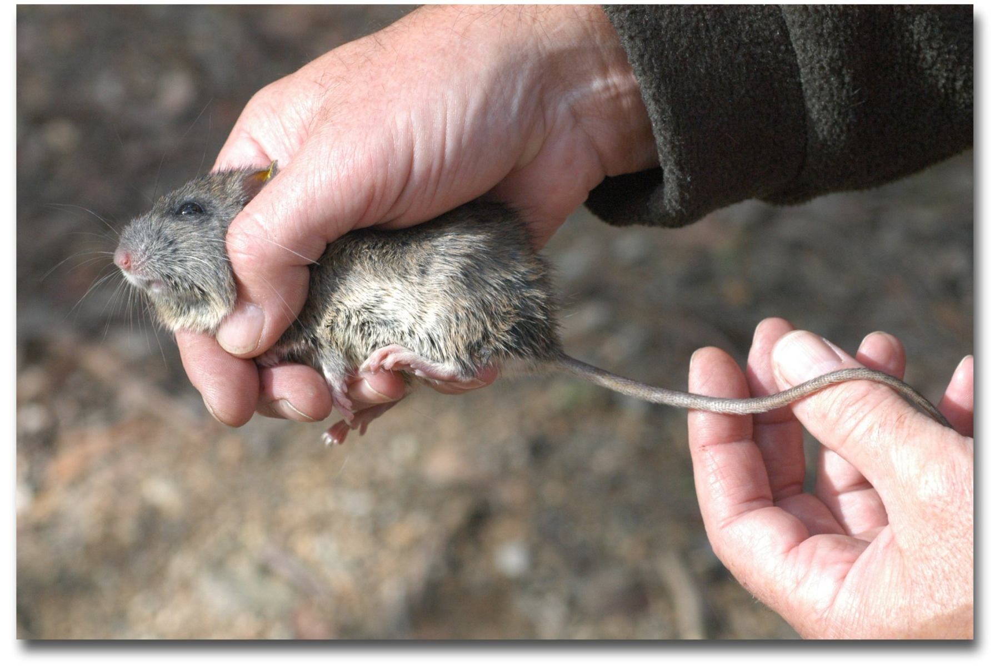
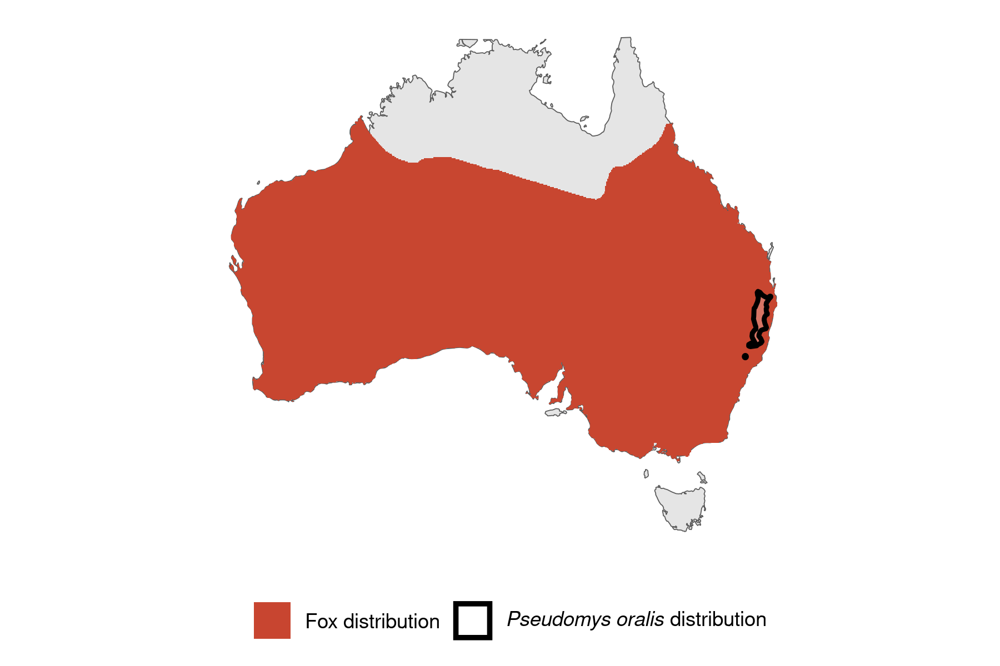

```{css, echo=FALSE}
h1, h2, h3 {
  text-align: center;
}
```

## **Hastings River mouse**
### *Pseudomys oralis*
### Blamed on foxes

:::: {style="display: flex;"}

[](https://www.inaturalist.org/photos/470330?size=original)

::: {}

:::

::: {}
  ```{r map, echo=FALSE, fig.cap="", out.width = '100%'}
  
  ```
:::

::::
<center>
IUCN status: **Vulnerable**

EPBC Predator Threat Rating: **High**

IUCN claim: *"Predation by Red Foxes (moderate): "*

</center>

### Studies in support

Hastings River mouse remains were found in foxes’ diet (Meek & Triggs 1999).

### Studies not in support

No studies

### Is the threat claim evidence-based?

There are no studies linking cats to Hastings River mouse populations.
<br>
<br>

![**Evidence linking *Pseudomys oralis* to foxes.** Systematic review of evidence for an association between *Pseudomys oralis* and foxes. Positive studies are in support of the hypothesis that *foxes* contribute to the decline of Pseudomys oralis, negative studies are not in support. Predation studies include studies documenting hunting or scavenging; baiting studies are associations between poison baiting and threatened mammal abundance where information on predator abundance is not provided; population studies are associations between threatened mammal and predator abundance.](assets/figures/Main_Evidence_Fox_Pseudomys oralis.png)

### References

Current submission (2023) Scant evidence that introduced predators cause extinctions. Conservation Biology

EPBC. (2015) Threat Abatement Plan for Predation by Feral Cats. Environment Protection and Biodiversity Conservation Act 1999, Department of Environment, Government of Australia. (Table A1).

IUCN Red List. https://www.iucnredlist.org/ Accessed June 2023

Meek, P.D. and Triggs, B., 1999. A record of Hastings River Mouse (Pseudomys oralis) in a fox (Vulpes vulpes) scat from New South Wales. In Proceedings-Linnean Society of New South Wales (Vol. 121, pp. 193-197). Linnean Society of New South Wales.

