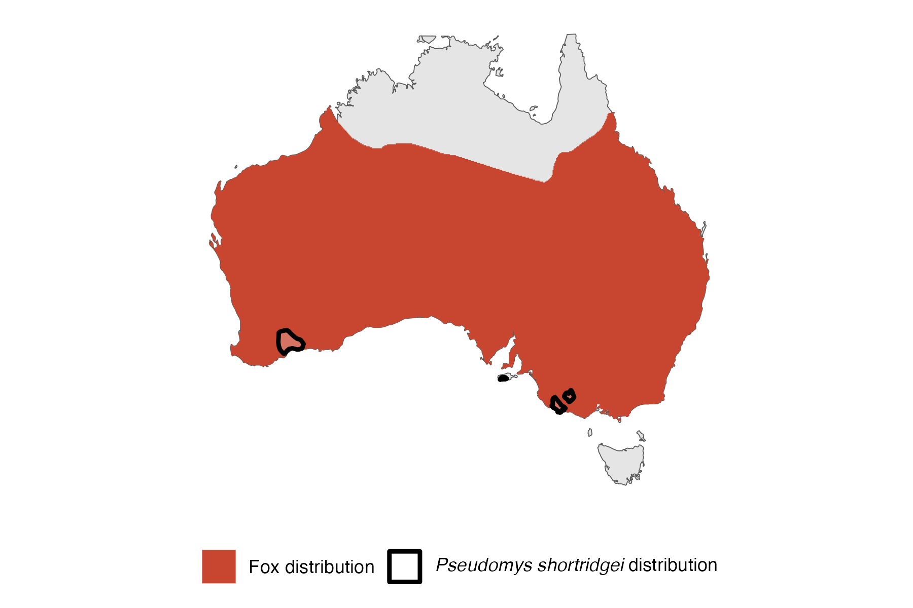

```{css, echo=FALSE}
h1, h2, h3 {
  text-align: center;
}
```

## **Heath mouse**
### *Pseudomys shortridgei*
### Blamed on foxes

:::: {style="display: flex;"}

[](https://www.inaturalist.org/photos/50688806?size=original)

::: {}

:::

::: {}
  ```{r map, echo=FALSE, fig.cap="", out.width = '100%'}
  
  ```
:::

::::
<center>
IUCN status: **Near Threatened**

EPBC Predator Threat Rating: **Not assessed**

IUCN claim: *" Predation by Red Foxes (Vulpes vulpes; moderate, entire range)"*

</center>

### Studies in support

Nalliah et al. (2022) reported a negative correlation between mice and foxes associated with fire and vegetation conditions. Heath mouse remains were found in foxes’ diet (Davis et al. 2015; Sinclair 2020).

### Studies not in support

No studies

### Is the threat claim evidence-based?

Foxes have been documented among a range of ecological variables negatively correlated with heath mouse abundance but cause of extirpation remains unknown.
<br>
<br>

![**Evidence linking *Pseudomys shortridgei* to foxes.** Systematic review of evidence for an association between *Pseudomys shortridgei* and foxes. Positive studies are in support of the hypothesis that *foxes* contribute to the decline of Pseudomys shortridgei, negative studies are not in support. Predation studies include studies documenting hunting or scavenging; baiting studies are associations between poison baiting and threatened mammal abundance where information on predator abundance is not provided; population studies are associations between threatened mammal and predator abundance.](assets/figures/Main_Evidence_Fox_Pseudomys shortridgei.png)

### References

Current submission (2023) Scant evidence that introduced predators cause extinctions. Conservation Biology

Davis, N.E., Forsyth, D.M., Triggs, B., Pascoe, C., Benshemesh, J., Robley, A., Lawrence, J., Ritchie, E.G., Nimmo, D.G. and Lumsden, L.F., 2015. Interspecific and geographic variation in the diets of sympatric carnivores: dingoes/wild dogs and red foxes in south-eastern Australia. PloS One, 10(3), p.e0120975.

EPBC. (2015) Threat Abatement Plan for Predation by Feral Cats. Environment Protection and Biodiversity Conservation Act 1999, Department of Environment, Government of Australia. (Table A1).

IUCN Red List. https://www.iucnredlist.org/ Accessed June 2023

Nalliah, R., Sitters, H., Smith, A., & Di Stefano, J. 2021. Untangling the influences of fire, habitat and introduced predators on the endangered heath mouse. Animal Conservation. doi:10.1111/acv.12731 

Sinclair, R., 2020. The diet of foxes in the Grampians (Gariwerd) National Park. Doctoral dissertation, Deakin University.

