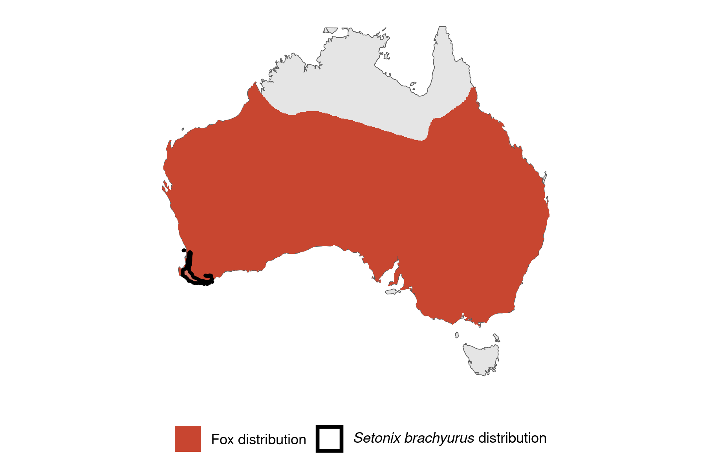
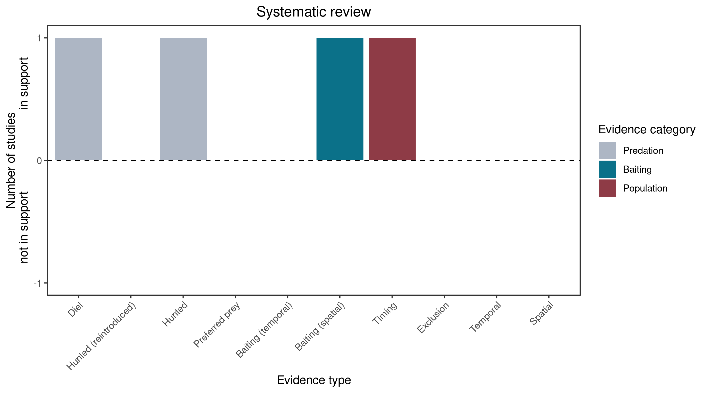

```{css, echo=FALSE}
h1, h2, h3 {
  text-align: center;
}
```

## **Quokka**
### *Setonix brachyurus*
### Blamed on foxes

:::: {style="display: flex;"}

::: {}
  ```{r icon, echo=FALSE, fig.cap="", out.width = '100%'}
  knitr::include_graphics("assets/phylopics/PLACEHOLDER_ready.png")
  ```
:::

::: {}

:::

::: {}
  ```{r map, echo=FALSE, fig.cap="", out.width = '100%'}
  
  ```
:::

::::
<center>
IUCN Status: **Vulnerable**

EPBC Threat Rating: **N/A**

IUCN Claim: *' Predation by red foxes and possibly feral cats has led to a past decline of mainland populations. Fox control has led to an increase in numbers in some areas.''*

</center>

### Studies in support

Foxes hunt quokkas (Hayward et al. 2005; Sinclair & Hyder 2009). Hayward et al. (2007) associated quokka presence with higher poison-baiting intensity. Hayward (2002) described a spatial correlation between quokka extirpation and fox establishment, but no analysis was provided.

### Studies not in support

No studies

### Is the threat claim evidence-based?

There are no studies evidencing a negative association between  foxes and quokka populations that include data analysis. Poison-baiting is not a reliable proxy of fox abundance.
<br>
<br>



### References

Hayward, Matt W., et al. "Mortality and survivorship of the quokka (Setonix brachyurus)(Macropodidae: Marsupialia) in the northern jarrah forest of Western Australia." Wildlife Research 32.8 (2005): 715-722

Hayward, M. 2002. The ecology of the Quokka (Setonix brachyurus) (Macropodidae: Marsupialia) in the northern jarrah forest of Australia. University of New South Wales.

Hayward, Matt W., et al. "Predicting the occurrence of the quokka, Setonix brachyurus (Macropodidae: Marsupialia), in Western Australia’s northern jarrah forest." Wildlife Research 34.3 (2007): 194-199

Sinclair, E. A. and Hyder, B. M. 2009. Surviving quokka (Setonix brachyurus) population on the Swan Coastal Plain, Western Australia. . Australian Mammalogy 31: 67-69.

Wallach et al. 2023 In Submission

