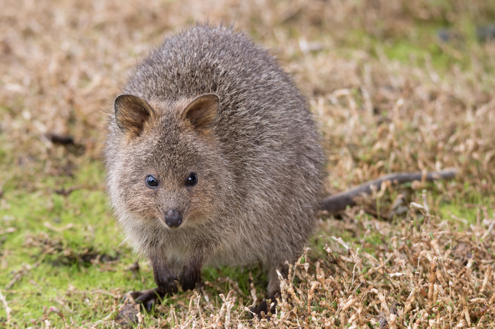

```{css, echo=FALSE}
h1, h2, h3 {
  text-align: center;
}
```

## **Quokka**
### *Setonix brachyurus*
### Blamed on foxes

:::: {style="display: flex;"}

[](https://www.inaturalist.org/photos/2301295?size=original)

::: {}

:::

::: {}
  ```{r map, echo=FALSE, fig.cap="", out.width = '100%'}
  knitr::include_graphics("assets/figures/Map_Fox_Setonix brachyurus.png")
  ```
:::

::::
<center>
IUCN status: **Vulnerable**

EPBC Threat Rating: **Not assessed**

IUCN claim: *" Predation by red foxes and possibly feral cats has led to a past decline of mainland populations. Fox control has led to an increase in numbers in some areas."*

</center>

### Studies in support

Foxes hunt quokkas (Hayward et al. 2005; Sinclair & Hyder 2009). Hayward et al. (2007) associated quokka presence with higher poison-baiting intensity. Hayward (2002) described a spatial correlation between quokka extirpation and fox establishment, but no analysis was provided.

### Studies not in support

No studies

### Is the threat claim evidence-based?

There are no studies evidencing a negative association between  foxes and quokka populations that include data analysis. Poison-baiting is not a reliable proxy of fox abundance.
<br>
<br>

![**Evidence linking *Setonix brachyurus* to foxes.** Systematic review of evidence for an association between *Setonix brachyurus* and foxes. Positive studies are in support of the hypothesis that *foxes* contribute to the decline of Setonix brachyurus, negative studies are not in support. Predation studies include studies documenting hunting or scavenging; baiting studies are associations between poison baiting and threatened mammal abundance where information on predator abundance is not provided; population studies are associations between threatened mammal and predator abundance.](assets/figures/Main_Evidence_Fox_Setonix brachyurus.png)

### References

Current submission (2023) Scant evidence that introduced predators cause extinctions. Conservation Biology

EPBC. (2013) Threat Abatement Plan for Predation by the European Red Fox (2008). Five yearly review. Environment Protection and Biodiversity Conservation Act 1999, Department of the Environment, Water, Heritage and the Arts, Government of Australia (Appendix E: EPBC Act listed threatened species).

Hayward, M. 2002. The ecology of the Quokka (Setonix brachyurus) (Macropodidae: Marsupialia) in the northern jarrah forest of Australia. University of New South Wales.

Hayward, M.W., de Tores, P.J., Augee, M.L. and Banks, P.B., 2005. Mortality and survivorship of the quokka (Setonix brachyurus)(Macropodidae: Marsupialia) in the northern jarrah forest of Western Australia. Wildlife Research, 32(8), pp.715-722.

Hayward, M.W., de Tores, P.J., Dillon, M.J. and Banks, P.B., 2007. Predicting the occurrence of the quokka, Setonix brachyurus (Macropodidae: Marsupialia), in Western Australia’s northern jarrah forest. Wildlife Research, 34(3), pp.194-199.

Sinclair, E.A. and Hyder, B.M., 2009. Surviving quokka (Setonix brachyurus) population on the Swan Coastal Plain, Western Australia. Australian Mammalogy, 31(1), pp.67-69.

