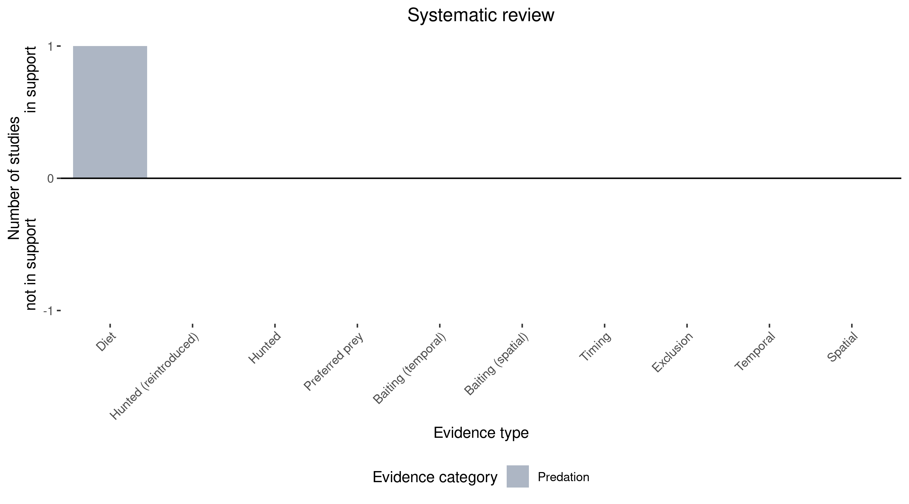

```{css, echo=FALSE}
h1, h2, h3 {
  text-align: center;
}
```

## **Julia Creek dunnart**
### *Sminthopsis douglasi*

:::: {style="display: flex;"}

::: {}
  ```{r icon, echo=FALSE, fig.cap="", out.width = '100%'}
  knitr::include_graphics("assets/phylopics/PLACEHOLDER_ready.png")
  ```
:::

::: {}

:::

::: {}
  ```{r map, echo=FALSE, fig.cap="", out.width = '100%'}
  knitr::include_graphics("assets/figures/Map_Fox_Sminthopsis douglasi.png")
  ```
:::

::::
<center>
IUCN Status: **Near Threatened**

EPBC Threat Rating: **Moderate**

IUCN Claim: *Exotic predators (especially cats and foxes)'*

</center>

### Studies in support

Foxes hunt them (Kutt 2003).

### Studies not in support

No studies

### Is the threat claim evidence-based?

There are no studies linking foxes to Julia Creek dunnart populations.
<br>
<br>



### References

Kutt, A.S. (2003). New records of the Julia Creek dunnart Sminthopsis douglasi in central-north Queensland. Australian Zoologist 32, 257-260.

Wallach et al. 2023 In Submission

