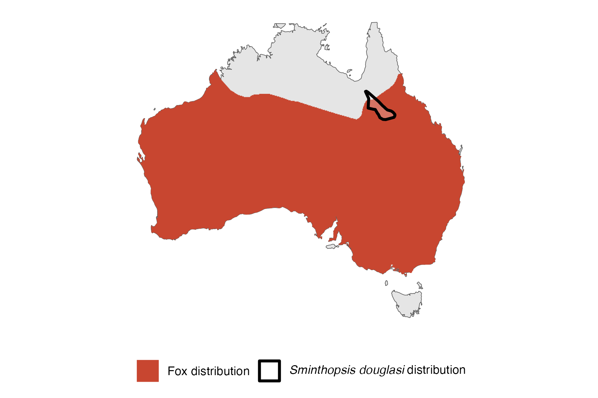

```{css, echo=FALSE}
h1, h2, h3 {
  text-align: center;
}
```

## **Julia Creek dunnart**
### *Sminthopsis douglasi*
### Blamed on foxes

:::: {style="display: flex;"}

[](https://www.inaturalist.org/photos/196659339?size=original)

::: {}

:::

::: {}
  ```{r map, echo=FALSE, fig.cap="", out.width = '100%'}
  
  ```
:::

::::
<center>
IUCN status: **Near Threatened**

EPBC Predator Threat Rating: **A threat**

IUCN claim: *"Exotic predators (especially cats and foxes)"*

</center>

### Studies in support

Foxes hunt Julia Creek dunnarts (Kutt 2003).

### Studies not in support

No studies

### Is the threat claim evidence-based?

There are no studies linking foxes to Julia Creek dunnart populations.
<br>
<br>

![**Evidence linking *Sminthopsis douglasi* to foxes.** Systematic review of evidence for an association between *Sminthopsis douglasi* and foxes. Positive studies are in support of the hypothesis that *foxes* contribute to the decline of Sminthopsis douglasi, negative studies are not in support. Predation studies include studies documenting hunting or scavenging; baiting studies are associations between poison baiting and threatened mammal abundance where information on predator abundance is not provided; population studies are associations between threatened mammal and predator abundance.](assets/figures/Main_Evidence_Fox_Sminthopsis douglasi.png)

### References

Current submission (2023) Scant evidence that introduced predators cause extinctions. Conservation Biology

EPBC. (2013) Threat Abatement Plan for Predation by the European Red Fox (2008). Five yearly review. Environment Protection and Biodiversity Conservation Act 1999, Department of the Environment, Water, Heritage and the Arts, Government of Australia (Appendix E: EPBC Act listed threatened species).

IUCN Red List. https://www.iucnredlist.org/ Accessed June 2023

Kutt, A.S., 2003. New records of the Julia Creek Dunnart Sminthopsis douglasi in central-north Queensland. Australian Zoologist, 32(2), pp.257-260.

