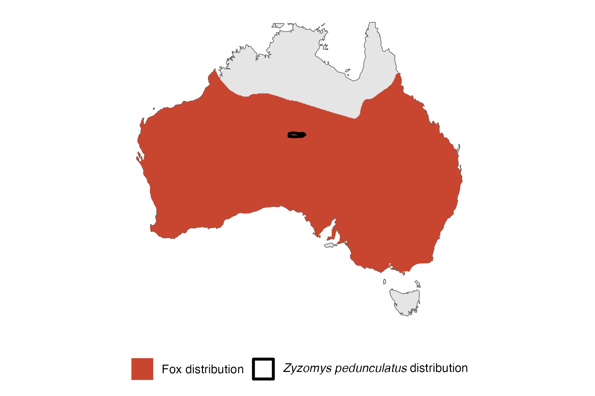

```{css, echo=FALSE}
h1, h2, h3 {
  text-align: center;
}
```

## **Central rock rat**
### *Zyzomys pedunculatus*
### Blamed on foxes

:::: {style="display: flex;"}

[](https://en.wikipedia.org/wiki/Central_rock_rat#/media/File:Zyzomys_pedunculatus.jpg)

::: {}

:::

::: {}
  ```{r map, echo=FALSE, fig.cap="", out.width = '100%'}
  
  ```
:::

::::
<center>
IUCN status: **Critically Endangered**

EPBC Predator Threat Rating: **Possible**

IUCN claim: *"Other threats may include predation by dogs or foxes;"*

</center>

### Studies in support

No studies

### Studies not in support

No studies

### Is the threat claim evidence-based?

There are no studies linking foxes to central rock rats.
<br>
<br>

![**Evidence linking *Zyzomys pedunculatus* to foxes.** Systematic review of evidence for an association between *Zyzomys pedunculatus* and foxes. Positive studies are in support of the hypothesis that *foxes* contribute to the decline of Zyzomys pedunculatus, negative studies are not in support. Predation studies include studies documenting hunting or scavenging; baiting studies are associations between poison baiting and threatened mammal abundance where information on predator abundance is not provided; population studies are associations between threatened mammal and predator abundance.](assets/figures/Main_Evidence_Fox_Zyzomys pedunculatus.png)

### References


Current submission (2023) Scant evidence that introduced predators cause extinctions. Conservation Biology

EPBC. (2013) Threat Abatement Plan for Predation by the European Red Fox (2008). Five yearly review. Environment Protection and Biodiversity Conservation Act 1999, Department of the Environment, Water, Heritage and the Arts, Government of Australia (Appendix E: EPBC Act listed threatened species).

IUCN Red List. https://www.iucnredlist.org/ Accessed June 2023

